# VÔ TRI — Backend Architecture (Design)

> **Trạng thái:** thiết kế hoàn chỉnh, chưa triển khai lên hạ tầng thật.
> Toàn bộ SQL trong tài liệu này đã được viết ra thành migration thật ở
> `supabase/migrations/` và **verify cú pháp bằng cách chạy trên một
> Postgres 16 container tạm** (không phải chỉ đọc bằng mắt) — xem §9. Việc
> còn lại cần chủ dự án: tạo project Supabase thật, cung cấp Project URL/
> Anon Key/Service Role Key, rồi mới `supabase db push` migration thật lên
> đó và nối Auth vào frontend.
>
> Tài liệu này giả định người đọc đã đọc
> [`PROJECT_HANDOFF.md`](./PROJECT_HANDOFF.md) (đặc biệt §7 "Extension
> points" và §10 "Hướng phát triển đề xuất") và
> [`VO_TRI_ARCHITECTURE.md`](./VO_TRI_ARCHITECTURE.md). Không lặp lại nội
> dung frontend ở đây trừ khi cần thiết cho quyết định backend.

---

## 1. Mục tiêu & nguyên tắc thiết kế

1. **Mọi bảng phải map được về một prop shape/type đã tồn tại trong
   frontend** (`ProfileStats`, `QuestProgress`, `LeaderboardPlayer`,
   `FeedItem`, ... — xem §5 bảng mapping). Không thiết kế bảng cho tính
   năng chưa có UI thật.
2. **Không tin dữ liệu client gửi lên cho bất cứ thứ gì liên quan đến
   điểm/XP/phần thưởng.** Điểm/XP luôn được server tính lại từ công thức
   gốc (`game/scoring.ts`), không bao giờ nhận thẳng số client báo. Đây là
   nguyên tắc bảo mật quan trọng nhất của thiết kế này — xem §7.
3. **RLS là lớp phòng thủ cuối, không phải lớp nghiệp vụ chính.** Logic
   nghiệp vụ (tính điểm, kiểm tra giới hạn/cooldown, cộng dồn tiến độ
   quest) nằm ở service layer (Server Actions chạy trên server), không
   nằm trong policy RLS. RLS đảm bảo: kể cả khi service layer có bug hoặc
   ai đó gọi thẳng Supabase client, họ vẫn không thể đọc/ghi dữ liệu của
   người khác.
4. **Catalog nội dung (activity/quest/milestone/badge/achievement) vẫn
   sống trong code frontend** (`activities.ts`, `quests.ts`,
   `milestones.ts`...) — đây là nội dung thiết kế game thật, không phải
   dữ liệu runtime. DB chỉ có bảng "mirror" nhẹ (id + field cần thiết cho
   FK/truy vấn) được seed từ đúng catalog đó, để có referential integrity
   thật khi join với bảng tiến độ người dùng.
5. **Không tạo bảng/migration cho thứ chưa có nhu cầu thật.** Ví dụ:
   không có bảng "sessions" riêng (Supabase Auth đã quản lý), không có
   materialized view cho leaderboard (chưa có traffic thật để cần tối ưu
   đó) — ghi rõ "chưa cần, đây là đường nâng cấp sau" thay vì xây trước.
6. **Migration một chiều, không phá dữ liệu.** Không bao giờ đổi kiểu cột
   phá hoại hoặc xoá cột có dữ liệu trong cùng một migration với việc
   thêm tính năng mới — xem §8.

---

## 2. Lựa chọn nền tảng: Supabase

**Quyết định: dùng Supabase**, đúng như CLAUDE.md's cost rules đã định
hướng ("free-tier Postgres") và `PROJECT_HANDOFF.md` §10 đã đề xuất.

Lý do cụ thể (không chỉ vì được yêu cầu ưu tiên, mà vì nó thật sự khớp
nhu cầu):

- **Một dịch vụ, ba nhu cầu:** Auth (email/password + OAuth sẵn có) +
  Postgres thật (không phải NoSQL — schema quan hệ rất rõ ràng cho
  Profile/Quest/Leaderboard) + Storage (cho avatar sau này) trong cùng
  một free tier, không cần ghép 3 nhà cung cấp khác nhau.
- **Row Level Security là Postgres RLS thật**, không phải một lớp
  authorization tự chế — khớp trực tiếp với nguyên tắc #3 ở trên.
- **`@supabase/ssr`** hỗ trợ Next.js App Router cookie-based session
  natively (Server Components, Server Actions, Middleware đều đọc được
  session) — không cần tự viết JWT refresh logic.
- **Migration là SQL file thật** (`supabase/migrations/*.sql`), không
  phải một ORM schema trừu tượng — dễ audit, dễ review diff, khớp
  nguyên tắc #6.
- Next.js Server Actions chạy trong cùng Node.js runtime với phần còn lại
  của codebase → service layer có thể import thẳng các module dùng chung
  đã có sẵn (`copy/microcopy.ts` cho nội dung notification/lỗi đúng
  giọng brand, `profile/ranks.ts` cho rank label...) thay vì viết lại
  logic đó lần hai ở một service riêng biệt.

**Không có quyết định nào tốt hơn được cân nhắc mà không dùng** — các lựa
chọn khác (Firebase, PlanetScale + NextAuth riêng, tự host Postgres) đều
hoặc đắt hơn ở free tier, hoặc cần ghép nhiều dịch vụ hơn cho cùng chức
năng, hoặc không có RLS Postgres thật.

---

## 3. Tổng quan ERD

```mermaid
erDiagram
    AUTH_USERS ||--|| PROFILES : "1:1 (trigger tạo tự động)"
    PROFILES ||--o{ ACTIVITY_SESSIONS : "chơi"
    PROFILES ||--o{ DAILY_ACTIVITY_LOG : "hoạt động mỗi ngày"
    PROFILES ||--o{ XP_LEDGER : "nhận điểm/XP"
    PROFILES ||--o{ QUEST_PROGRESS : "tiến độ quest"
    PROFILES ||--o{ MILESTONE_PROGRESS : "tiến độ milestone"
    PROFILES ||--o{ USER_ACHIEVEMENTS : "mở khoá"
    PROFILES ||--o{ USER_BADGES : "mở khoá"
    PROFILES ||--o{ USER_COLLECTION_ITEMS : "mở khoá"
    PROFILES ||--o{ FOLLOWS : "follower_id"
    PROFILES ||--o{ FOLLOWS : "followee_id"
    PROFILES ||--o{ REACTIONS : "thả cảm xúc"
    PROFILES ||--o{ COMMENTS : "viết"
    PROFILES ||--o{ FEED_ITEMS : "actor_id (hệ thống tạo)"
    PROFILES ||--o{ NOTIFICATIONS : "nhận"
    PROFILES ||--o{ JOURNEY_EVENTS : "dòng thời gian"
    PROFILES ||--o{ AUDIT_LOG : "actor_id"

    ACTIVITIES ||--o{ ACTIVITY_SESSIONS : "activity_id"
    QUEST_DEFINITIONS ||--o{ QUEST_PROGRESS : "quest_id"
    MILESTONE_DEFINITIONS ||--o{ MILESTONE_PROGRESS : "milestone_id"
    ACHIEVEMENT_DEFINITIONS ||--o{ USER_ACHIEVEMENTS : "achievement_id"
    BADGE_DEFINITIONS ||--o{ USER_BADGES : "badge_id"
    COLLECTION_DEFINITIONS ||--o{ USER_COLLECTION_ITEMS : "item_id"
    SEASONS ||--o{ LEADERBOARD_RANK_SNAPSHOTS : "season_id (khi scope=season)"
```



24 bảng, chia 8 nhóm chức năng (chi tiết cột ở §4):

| Nhóm | Bảng |
|---|---|
| Danh tính | `profiles` |
| Catalog (mirror từ code) | `activities`, `quest_definitions`, `milestone_definitions`, `achievement_definitions`, `badge_definitions`, `collection_definitions`, `seasons` |
| Gameplay & kinh tế thưởng | `activity_sessions`, `daily_activity_log`, `xp_ledger` |
| Retention | `quest_progress`, `milestone_progress` |
| Unlock | `user_achievements`, `user_badges`, `user_collection_items` |
| Xã hội | `follows`, `reactions`, `comments`, `feed_items` |
| Thông báo & timeline | `notifications`, `journey_events` |
| Xếp hạng & vận hành | `leaderboard_rank_snapshots`, `audit_log` |

---

## 4. Schema chi tiết

Quy ước: `snake_case`, `timestamptz` cho mọi thời điểm, `gen_random_uuid()`
làm PK mặc định (built-in từ Postgres 13+, không cần extension). Bảng
catalog dùng `id text` (khớp id string trong code, ví dụ `"diem-danh"`)
thay vì `uuid`, để mirror đúng 1-1 với catalog code.

### 4.1 `profiles` — mở rộng `auth.users`

```sql
create table public.profiles (
  id uuid primary key references auth.users(id) on delete cascade,
  username citext unique not null,
  display_name text not null,
  avatar_url text,
  tagline text,
  -- Kinh tế thưởng — nguồn sự thật là xp_ledger/activity_sessions,
  -- các cột dưới đây là cache đã denormalize để đọc nhanh (leaderboard,
  -- Profile, Home đều cần đọc điểm/level cực nhanh, không thể SUM() mỗi lần).
  points integer not null default 0,
  total_xp_earned bigint not null default 0,
  level integer not null default 1,
  xp integer not null default 0,        -- tiến độ trong level hiện tại
  xp_to_next integer not null default 50,
  current_streak integer not null default 0,
  longest_streak integer not null default 0,
  last_active_date date,
  total_active_days integer not null default 0,
  total_activities_played integer not null default 0,
  joined_at timestamptz not null default now(),
  updated_at timestamptz not null default now()
);
```

Ánh xạ trực tiếp: `ProfileIdentity` (displayName/username/avatarUrl/
tagline/joinedAt) + `ProfileStats` (points/level/xp/streakDays/activeDays/
activitiesPlayed) + `LevelProgress` (level/xp/xpToNext). `online` field
của `ProfileIdentity` **không lưu DB** — đây là trạng thái tức thời (ai
đang mở app), thuộc về Supabase Realtime Presence sau này, không phải một
cột persist (xem §10, mục "chưa cần").

`username` dùng kiểu `citext` (case-insensitive text — cần bật extension
`citext`) để "AnDuy" và "anduy" là cùng một username, tránh username giả
mạo bằng cách đổi hoa/thường.

**Tự động tạo khi đăng ký** — không có INSERT policy cho client (xem
§6.1), chỉ trigger sau khi `auth.users` có row mới:

```sql
create function public.handle_new_user()
returns trigger
language plpgsql
security definer set search_path = public
as $$
begin
  insert into public.profiles (id, username, display_name)
  values (
    new.id,
    coalesce(new.raw_user_meta_data->>'username', 'user_' || substr(new.id::text, 1, 8)),
    coalesce(new.raw_user_meta_data->>'display_name', 'Người Vô Tri Mới')
  );
  return new;
end;
$$;

create trigger on_auth_user_created
  after insert on auth.users
  for each row execute function public.handle_new_user();
```

Username mặc định là placeholder tự sinh (`user_xxxxxxxx`) nếu người
dùng không cung cấp — tránh trạng thái "profile chưa có username" mà
`citext unique not null` sẽ chặn.

### 4.2 Catalog (mirror từ code, seed qua migration)

```sql
create table public.activities (
  id text primary key,               -- khớp Activity.id trong activities.ts
  name text not null,
  category text not null,
  difficulty text not null check (difficulty in ('de','vua','kho')),
  reward integer not null,
  xp integer not null,
  daily_limit integer,
  cooldown_minutes integer,
  is_coming_soon boolean not null default false,
  updated_at timestamptz not null default now()
);

create table public.quest_definitions (
  id text primary key,
  cadence text not null check (cadence in ('daily','weekly')),
  target integer not null,
  reward integer not null,
  xp integer not null
);

create table public.milestone_definitions (
  id text primary key,
  metric text not null check (metric in ('streak','activitiesPlayed')),
  threshold integer not null
);

create table public.achievement_definitions (
  id text primary key,
  name text not null,
  description text not null
);

create table public.badge_definitions (
  id text primary key,
  name text not null,
  description text not null,
  rarity text not null check (rarity in ('common','rare','special'))
);

create table public.collection_definitions (
  id text primary key,
  name text not null,
  kind text not null check (kind in ('skin','title','item'))
);

create table public.seasons (
  id uuid primary key default gen_random_uuid(),
  name text not null,
  starts_at timestamptz not null,
  ends_at timestamptz not null
);
```

**Không lưu `icon`** trong bất kỳ bảng catalog nào — `LucideIcon` là một
component reference, không thể serialize vào DB (đúng lỗi RSC boundary
đã gặp nhiều lần, xem `VO_TRI_ARCHITECTURE.md`'s "Recurring RSC gotcha").
Frontend tiếp tục map `id` → icon qua chính catalog code hiện có
(`activities.ts`, `reactions.ts`...), backend chỉ cần trả về `id`.

Seed data cho các bảng này **idempotent** (`insert ... on conflict (id) do
update`) để sửa `quests.ts`/`activities.ts` trong code và re-run migration
không bị lỗi trùng khoá hay tạo bản ghi ma — xem §8.

### 4.3 Gameplay & kinh tế thưởng

```sql
create table public.activity_sessions (
  id uuid primary key default gen_random_uuid(),
  user_id uuid not null references public.profiles(id) on delete cascade,
  activity_id text not null references public.activities(id),
  kind text not null check (kind in ('win','lose','complete','timeout','abandoned')),
  client_reported_points integer,   -- giữ lại để đối chiếu/phát hiện gian lận, KHÔNG dùng để cộng điểm
  awarded_points integer not null,  -- số điểm THẬT SỰ được cộng, do server tính (xem §7)
  awarded_xp integer not null,
  combo_max integer not null default 0,
  duration_seconds integer not null default 0,
  created_at timestamptz not null default now()
);
create index on public.activity_sessions (user_id, created_at desc);
create index on public.activity_sessions (user_id, activity_id, created_at desc);

create table public.daily_activity_log (
  user_id uuid not null references public.profiles(id) on delete cascade,
  activity_date date not null,
  primary key (user_id, activity_date)
);

create table public.xp_ledger (
  id uuid primary key default gen_random_uuid(),
  user_id uuid not null references public.profiles(id) on delete cascade,
  source text not null check (source in ('activity_session','quest_claim','milestone_claim')),
  source_id uuid,                   -- id của activity_session / quest_progress / milestone_progress liên quan
  points integer not null default 0,
  xp integer not null default 0,
  created_at timestamptz not null default now()
);
create index on public.xp_ledger (user_id, created_at desc);
```

`activity_sessions` là backing store cho `SessionStats` (attempts =
`count(*)`, bestScore = `max(awarded_points)`, durationSeconds = phiên gần
nhất) — nhưng lưu ý: `SessionStats` trong `game/types.ts` hiện là
**client-only, reset khi reload** (theo thiết kế của Gameplay Engine,
xem `VO_TRI_GAMEPLAY_ENGINE.md` §7) — bảng này KHÔNG thay thế
`SessionStats` phía client, nó là nguồn dữ liệu **lifetime** cho
`ProfileStats.activitiesPlayed` và cho Leaderboard theo scope
week/month/season sau này (query theo `created_at` range).

`daily_activity_log` là nguồn sự thật cho streak — một dòng nghĩa là
"user có hoạt động thật trong ngày đó" (chèn khi có `activity_sessions`
mới hoặc check-in). `StreakTracker.last7Days` được suy ra bằng một truy
vấn 7 ngày gần nhất trên bảng này, không lưu mảng boolean riêng.

### 4.4 Retention (Quest/Milestone)

```sql
create table public.quest_progress (
  user_id uuid not null references public.profiles(id) on delete cascade,
  quest_id text not null references public.quest_definitions(id),
  period_key date not null,   -- daily: chính ngày đó; weekly: thứ Hai đầu tuần (ISO)
  current_value integer not null default 0,
  claimed_at timestamptz,
  updated_at timestamptz not null default now(),
  primary key (user_id, quest_id, period_key)
);

create table public.milestone_progress (
  user_id uuid not null references public.profiles(id) on delete cascade,
  milestone_id text not null references public.milestone_definitions(id),
  reached_at timestamptz,    -- server phát hiện đã vượt threshold
  claimed_at timestamptz,    -- người dùng đã bấm "Nhận thưởng"
  primary key (user_id, milestone_id)
);
```

`milestone_progress` **không lưu `current`** — giá trị hiện tại luôn suy
ra từ `profiles.current_streak`/`profiles.total_activities_played` so với
`milestone_definitions.threshold` tại thời điểm đọc (tránh hai nguồn sự
thật lệch nhau). Chỉ `reached_at`/`claimed_at` cần persist vì đó là sự
kiện, không phải giá trị suy ra được.

`quest_progress.period_key` là chìa khoá của cơ chế "reset mỗi ngày/tuần"
— một dòng mới cho mỗi chu kỳ thay vì UPDATE dòng cũ, nên lịch sử các chu
kỳ trước tự động trở thành dữ liệu lịch sử cho `journey_events`/audit,
không cần bảng riêng.

### 4.5 Unlock (Achievement/Badge/Collection)

```sql
create table public.user_achievements (
  user_id uuid not null references public.profiles(id) on delete cascade,
  achievement_id text not null references public.achievement_definitions(id),
  unlocked_at timestamptz not null default now(),
  primary key (user_id, achievement_id)
);

create table public.user_badges (
  user_id uuid not null references public.profiles(id) on delete cascade,
  badge_id text not null references public.badge_definitions(id),
  unlocked_at timestamptz not null default now(),
  primary key (user_id, badge_id)
);

create table public.user_collection_items (
  user_id uuid not null references public.profiles(id) on delete cascade,
  item_id text not null references public.collection_definitions(id),
  unlocked_at timestamptz not null default now(),
  primary key (user_id, item_id)
);
```

Giữ 3 bảng riêng thay vì gộp thành một bảng "unlockables" chung — vì
frontend đã cố ý tách `Achievement`/`ProfileBadge`/`CollectionItem` thành
3 type và 3 section khác nhau trên Profile (`AchievementSection`,
`BadgeCollection`, `CollectionShowcase`), mirror đúng ranh giới đó thay vì
ép gộp cho "DRY" giả tạo — đúng nguyên tắc tổ chức mã nguồn #2 trong
`PROJECT_HANDOFF.md`.

### 4.6 Xã hội

```sql
create table public.follows (
  follower_id uuid not null references public.profiles(id) on delete cascade,
  followee_id uuid not null references public.profiles(id) on delete cascade,
  created_at timestamptz not null default now(),
  primary key (follower_id, followee_id),
  check (follower_id <> followee_id)
);

create table public.reactions (
  id uuid primary key default gen_random_uuid(),
  user_id uuid not null references public.profiles(id) on delete cascade,
  target_type text not null check (target_type in ('feed_item','comment')),
  target_id uuid not null,
  reaction_id text not null check (reaction_id in ('thich','cuoi','dinh','bat-ngo','vo-tri')),
  created_at timestamptz not null default now(),
  unique (user_id, target_type, target_id)
);

create table public.comments (
  id uuid primary key default gen_random_uuid(),
  target_type text not null check (target_type in ('activity','feed_item')),
  target_id text not null,
  author_id uuid not null references public.profiles(id) on delete cascade,
  parent_comment_id uuid references public.comments(id) on delete cascade,
  body text not null check (char_length(body) between 1 and 1000),
  created_at timestamptz not null default now(),
  deleted_at timestamptz
);
create index on public.comments (target_type, target_id, created_at desc);

create table public.feed_items (
  id uuid primary key default gen_random_uuid(),
  actor_id uuid not null references public.profiles(id) on delete cascade,
  event_type text not null check (event_type in ('level_up','milestone','achievement','quest_claim')),
  text text not null,
  created_at timestamptz not null default now()
);
create index on public.feed_items (created_at desc);
```

`reaction_id` dùng đúng 5 giá trị trong `social/reactions.ts`
(`thich`/`cuoi`/`dinh`/`bat-ngo`/`vo-tri`) — check constraint thay vì bảng
`reaction_kinds` riêng, vì bộ reaction là cố định trong brand voice, không
phải nội dung do người dùng/admin tạo thêm được (đổi = sửa code + một
migration mới, không cần bảng động cho việc hiếm khi xảy ra).

`feed_items.text` **không phải nội dung người dùng tự viết** — đây là mô
tả hệ thống tự sinh ("X vừa đạt Cao Thủ") khi có sự kiện thật (lên cấp/
milestone/thành tích/claim quest), đúng nguyên tắc "không dữ liệu giả":
feed chỉ chứa sự kiện thật, không có nút "đăng bài" nào trong frontend
hiện tại. `event_type` giới hạn đúng các sự kiện service layer thật sự
tạo ra (xem §9.3) — không cho phép insert tự do.

### 4.7 Thông báo & timeline

```sql
create table public.notifications (
  id uuid primary key default gen_random_uuid(),
  user_id uuid not null references public.profiles(id) on delete cascade,
  type text not null check (type in ('achievement','reward','friend','system')),
  title text not null,
  description text not null,
  read_at timestamptz,
  created_at timestamptz not null default now()
);
create index on public.notifications (user_id, created_at desc);

create table public.journey_events (
  id uuid primary key default gen_random_uuid(),
  user_id uuid not null references public.profiles(id) on delete cascade,
  type text not null check (type in ('joined','level-up','achievement','reward','quest','milestone','streak')),
  label text not null,
  occurred_at timestamptz not null default now()
);
create index on public.journey_events (user_id, occurred_at desc);
```

Cả hai bảng map 1-1 với `NotificationItem`/`JourneyEvent` — không cần
biến đổi gì thêm phía frontend khi nối dữ liệu thật.

### 4.8 Xếp hạng & vận hành

```sql
create table public.leaderboard_rank_snapshots (
  id uuid primary key default gen_random_uuid(),
  user_id uuid not null references public.profiles(id) on delete cascade,
  scope text not null check (scope in ('global','week','month','season')),
  season_id uuid references public.seasons(id),
  rank integer not null,
  points integer not null,
  captured_at timestamptz not null default now()
);
create index on public.leaderboard_rank_snapshots (scope, user_id, captured_at desc);

create table public.audit_log (
  id uuid primary key default gen_random_uuid(),
  actor_id uuid references public.profiles(id) on delete set null,
  action text not null,
  target_type text,
  target_id text,
  metadata jsonb not null default '{}'::jsonb,
  created_at timestamptz not null default now()
);
create index on public.audit_log (created_at desc);
```

`leaderboard_rank_snapshots` là nguồn cho `RankChangeIcon`
(`previousRank` = snapshot gần nhất trước snapshot hiện tại của cùng
scope) — bảng này **chỉ cần khi có snapshot job chạy**, xem §10 "chưa
triển khai — Phase sau" (không tạo cron job ngay vì chưa có traffic thật
để snapshot).

`audit_log` là log vận hành/bảo mật chung (khác `xp_ledger` — đó là log
"kinh tế" người dùng có thể tự xem; `audit_log` không lộ cho client, chỉ
đọc qua Supabase Dashboard hoặc một trang admin sau này).

---

## 5. Mapping: frontend type → bảng DB

| Frontend type | Nguồn | Bảng/cột DB |
|---|---|---|
| `VoTriUser` (shell/types.ts) | Header/Sidebar | View kết hợp `auth.users` + `profiles` (xem §9.2) |
| `ProfileIdentity` | profile/types.ts | `profiles.{username,display_name,avatar_url,tagline,joined_at}` |
| `ProfileStats` | profile/types.ts | `profiles.{points,level,xp,current_streak→streakDays,total_active_days→activeDays,total_activities_played→activitiesPlayed}` |
| `LevelProgress` | profile/types.ts | `profiles.{level,xp,xp_to_next}` |
| `TodayStats` | home/TodayCard.tsx | Kết hợp `profiles` + `StreakData` (xem dưới) |
| `StreakData` | retention/types.ts | `profiles.{current_streak,longest_streak}` + 7 dòng gần nhất của `daily_activity_log` |
| `Achievement[]` | profile/types.ts | `user_achievements` join `achievement_definitions` |
| `ProfileBadge[]` | profile/types.ts | `badge_definitions` left join `user_badges` (unlocked = có dòng join) |
| `CollectionItem[]` | profile/types.ts | `collection_definitions` left join `user_collection_items` |
| `JourneyEvent[]` | profile/types.ts | `journey_events` |
| `Activity[]` | explore/types.ts | Vẫn là `activities.ts` (code) — DB chỉ mirror cho FK |
| `QuestDefinition[]` + `QuestProgress` | retention/types.ts | `quest_definitions` (code mirror) + `quest_progress` |
| `MilestoneDefinition[]` + `MilestoneProgress` | retention/types.ts | `milestone_definitions` (code mirror) + `milestone_progress` |
| `ClaimResult` | retention/types.ts | Trả về từ RPC `claim_quest`/`claim_milestone` (xem §9.3), không phải một bảng |
| `LeaderboardPlayer[]` | leaderboard/types.ts | Query `profiles` `order by points desc` (scope=global) hoặc join `xp_ledger`/`follows` cho scope khác |
| `MyPosition` | leaderboard/types.ts | Tính từ cùng query trên, vị trí của `auth.uid()` |
| `RankChange` | leaderboard/types.ts | So sánh `leaderboard_rank_snapshots` mới nhất vs. gần nhất trước đó |
| `SessionStats` | game/types.ts | **Vẫn client-only theo thiết kế Engine** — không map DB. Lifetime stats dùng `activity_sessions` riêng |
| `GameOutcome` | game/types.ts | Server trả `awarded_points`/`awarded_xp` thật qua RPC `record_activity_session` |
| `FeedItem[]` | social/types.ts | `feed_items` join `profiles` (actor) |
| `NotificationItem[]` | social/types.ts | `notifications` |
| `CommentData[]` | social/types.ts | `comments` (self-join `parent_comment_id` cho replies) join `profiles` |
| `UserPreview` | social/types.ts | `profiles` + `getRank(level)` tính ở client/service, không lưu DB |
| `ReactionCounts` | social/types.ts | `select reaction_id, count(*) from reactions where target_type=... and target_id=... group by reaction_id` |

---

## 6. Security

### 6.1 Nguyên tắc chung

- **Bảng "sự kiện thô" (activity_sessions, xp_ledger, quest_progress,
  milestone_progress, notifications, audit_log): SELECT riêng tư** —
  chỉ chủ sở hữu (`auth.uid() = user_id`) đọc được, trừ `audit_log`
  (không client nào đọc được).
- **Bảng "hồ sơ công khai" (profiles, user_achievements, user_badges,
  user_collection_items, journey_events, follows, reactions, comments,
  feed_items): SELECT công khai** (`using (true)`) — đúng bản chất một
  sản phẩm cộng đồng/leaderboard, nơi hồ sơ người khác vốn phải xem được
  (Leaderboard, UserPreviewCard đã hiển thị điểm/level/badge của người
  khác từ trước).
- **INSERT/UPDATE cho dữ liệu có thể ảnh hưởng điểm/XP/phần thưởng: KHÔNG
  cho phép trực tiếp từ client**, kể cả khi RLS cho phép ghi vào đúng
  `user_id` của mình — luôn đi qua hàm `security definer` (§6.2), vì
  logic tính điểm/kiểm tra giới hạn nằm ở đó, không nằm ở policy.
- **Bảng catalog: SELECT công khai, không ai (kể cả chủ sở hữu) ghi
  được** qua client — catalog chỉ đổi qua migration.
- **INSERT/UPDATE/DELETE mặc định là DENY** — mọi bảng bật RLS
  (`enable row level security`), chỉ thêm policy cho đúng thao tác được
  phép, không có bảng nào "quên bật RLS" (lỗi phổ biến nhất trong dự án
  Supabase thật).

### 6.2 `security definer` — khi nào cần

Các thao tác sau **phải** đi qua một Postgres function `security definer`
(chạy với quyền của người tạo hàm, bỏ qua RLS bên trong, nhưng có kiểm
tra logic tường minh bên trong hàm) thay vì UPDATE/INSERT trực tiếp:

| Hàm | Việc nó làm | Vì sao không thể là policy đơn thuần |
|---|---|---|
| `record_activity_session(...)` | Kẹp điểm/XP client báo vào trần dựa trên catalog (§7), kiểm tra dailyLimit/cooldown, ghi `activity_sessions`+`xp_ledger`+`daily_activity_log`, cập nhật `profiles`, có thể tạo `feed_items`/`notifications`/`journey_events` nếu lên cấp | Nhiều bước kiểm tra/cập nhật theo chuỗi — không biểu diễn được bằng một `check` hay policy RLS đơn lẻ |
| `claim_quest(quest_id)` | Kiểm tra `current_value >= target` và `claimed_at is null`, cộng `reward`/`xp`, set `claimed_at` | Tránh client tự set `claimed_at` mà chưa đủ điều kiện |
| `claim_milestone(milestone_id)` | Tương tự, cộng thưởng cố định của milestone | Tương tự |
| `advance_quest_progress(...)` | Được gọi nội bộ bởi `record_activity_session` để cộng dồn tiến độ quest tương ứng (chơi 2 hoạt động, đạt 50 điểm...) | Logic điều kiện phức tạp theo loại quest |
| `toggle_follow(target_id)` | Insert/delete `follows`, kiểm tra không tự follow chính mình | Đơn giản nhưng gộp vào RPC để tương lai dễ thêm rate-limit |

Các bảng trên **không có INSERT/UPDATE policy nào cho vai trò
`authenticated`** — chỉ vai trò chạy các hàm `security definer` (định
nghĩa là `security definer` nghĩa là chạy với quyền `postgres`/owner của
hàm, không phải quyền người gọi) mới ghi được. Điều này chặn hoàn toàn
khả năng một client gọi thẳng `supabase.from('activity_sessions').insert(...)`
với điểm số tự bịa.

### 6.3 Storage — bucket `avatars`

```sql
insert into storage.buckets (id, name, public) values ('avatars', 'avatars', true);

create policy "avatar images are publicly readable"
  on storage.objects for select
  using (bucket_id = 'avatars');

create policy "users can upload their own avatar"
  on storage.objects for insert
  with check (
    bucket_id = 'avatars'
    and auth.uid()::text = (storage.foldername(name))[1]
  );

create policy "users can update their own avatar"
  on storage.objects for update
  using (
    bucket_id = 'avatars'
    and auth.uid()::text = (storage.foldername(name))[1]
  );
```

Quy ước path: `avatars/{user_id}/{filename}` — policy dùng
`storage.foldername(name)[1]` (thư mục con đầu tiên) để đảm bảo user chỉ
ghi được vào đúng thư mục mang uid của chính mình. Đọc thì công khai
(avatar hiển thị ở Header/comment/leaderboard cho mọi người xem).

### 6.4 Permission model tóm tắt

| Vai trò | Có thể |
|---|---|
| `anon` (chưa đăng nhập) | SELECT các bảng công khai (profiles, catalog, leaderboard, feed, comments...). Không ghi được gì. |
| `authenticated` (đã đăng nhập) | Thêm: SELECT dữ liệu riêng của chính mình (sessions, quest progress, notifications...); INSERT/UPDATE/DELETE đúng `auth.uid()` của mình ở các bảng cho phép (comments, reactions, follows); gọi mọi RPC `security definer` (RPC tự kiểm tra `auth.uid()` bên trong). |
| `service_role` (chỉ server-side, không bao giờ lộ ra client) | Bỏ qua RLS hoàn toàn — dùng cho: job snapshot leaderboard định kỳ, script seed/migrate, thao tác admin/moderation tương lai. |

---

## 7. Anti-cheat: không tin điểm số client báo

Đây là quyết định bảo mật quan trọng nhất của thiết kế, vì đây là dữ
liệu duy nhất trong sản phẩm có "giá trị" (điểm/XP/level/rank) — dù chưa
gắn với thanh toán thật, vẫn nên thiết kế đúng ngay từ đầu thay vì vá sau.

**Vì sao không thể "tính lại chính xác" phía server (và tại sao bản
nháp đầu của thiết kế này sai ở điểm đó):** `GameOutcome.points` không
phải kết quả của một công thức đóng theo `(comboMax, durationSeconds)` —
nó là tổng cộng dồn của nhiều lần gọi `ctx.addScore(basePoints)` trong
lúc chơi, mỗi lần áp dụng hệ số combo tại đúng thời điểm đó
(`GameFrame.tsx`'s `addScore`). Muốn server tái tạo chính xác số điểm đó,
cần log lại **toàn bộ chuỗi sự kiện** (mỗi lần `addScore`/`registerHit`/
`registerMiss` xảy ra) rồi replay ở server — điều này cần **sửa
`GameFrame`/`PlayClient` để ghi log sự kiện**, một thay đổi frontend thật
sự (không chỉ backend), nằm ngoài phạm vi "không đổi frontend nếu không
thật sự cần" của lượt này. Ghi nhận rõ đây là hướng nâng cấp tương lai
(xem cuối mục này), không phải thiếu sót bị bỏ quên.

Thực tế kiểm tra `PlayClient.tsx` (Activity thật duy nhất hiện có) còn
cho thấy: nút "Hoàn thành" gọi `ctx.complete({ points: activity.reward,
xp: activity.xp })` — dùng thẳng giá trị catalog cố định, không liên
quan gì đến điểm combo tích luỹ; còn nút demo "Thử thua" gọi
`ctx.lose({ points: ctx.score, xp: Math.round(activity.xp / 2) })` — cả
`points` lẫn `xp` đều có thể bị client chỉnh tuỳ theo nhánh UI nào được
gọi. Tức là **cả hai trường `points` và `xp` đều cần được coi là "client
tự báo", không có trường nào mặc định an toàn.**

**Thiết kế v1 (đủ dùng cho một game giải trí chưa gắn tiền thật, không
phải một hệ chống gian lận hoàn chỉnh — cố tình giới hạn phạm vi, ghi rõ
ở đây thay vì tự nhận là "đã giải quyết xong"):**

1. Client gọi Server Action `recordActivitySession({ activityId, kind,
   clientReportedPoints, clientReportedXp, comboMax, durationSeconds })`.
2. RPC `record_activity_session` (chạy trong Postgres, `authenticated`
   được phép gọi trực tiếp — xem vì sao an toàn ở dưới):
   - Đọc `reward`/`xp` thật của activity từ bảng `activities` bằng
     `activity_id` (giá trị duy nhất không thể client tự bịa, vì phải
     khớp một dòng có thật trong bảng catalog).
   - **Kẹp giá trị** thay vì tính lại chính xác:
     `awarded_points = least(clientReportedPoints, activities.reward * 3)`,
     `awarded_xp = least(clientReportedXp, activities.xp * 3)` — hệ số
     ×3 là biên rộng rãi có chủ đích (đủ chỗ cho combo/scoring thật sự
     vượt qua phần thưởng hoàn thành cơ bản), chặn đứng trường hợp cực
     đoan (client tự báo 999999 điểm cho một activity 15 điểm) mà không
     cần biết chính xác người chơi đã làm gì trong phiên.
   - Nếu `clientReportedPoints`/`clientReportedXp` bị kẹp lại (tức giá
     trị client báo cao hơn trần) → vẫn ghi `awarded_points`/`awarded_xp`
     đã kẹp, đồng thời ghi một dòng vào `audit_log`
     (action = `'score_clamped'`) để rà soát sau — không chặn người
     chơi, chỉ gắn cờ.
   - Kiểm tra `dailyLimit`/`cooldownMinutes` bằng cách đếm
     `activity_sessions` gần đây của đúng user+activity — đây mới là
     phần **chặn được chính xác 100%** (không có gì mơ hồ: đếm số dòng
     là phép toán chính xác), khác với phần điểm số ở trên (chỉ kẹp
     biên, không xác thực chính xác).
3. RPC trả về `awarded_points`/`awarded_xp`/`leveledUp?`/
   `milestoneReached?` thật — Server Action trả cho client để hiệu chỉnh
   `ResultScreen`/`RewardReveal` hiển thị đúng số đã ghi nhận.

**Vì sao RPC được phép gọi trực tiếp bởi `authenticated`** (không cần
service-role, không cần Server Action "giả danh" người dùng): vì RPC
không tin bất kỳ tham số nào của client làm giá trị cuối cùng — nó chỉ
dùng chúng làm **trần trên**, và tự tính trần đó hoàn toàn từ dữ liệu
catalog phía server. Một client gọi thẳng
`supabase.rpc('record_activity_session', {...})` với số cực lớn cũng chỉ
nhận được đúng trần cho phép, không hơn.

**Hướng nâng cấp tương lai (chưa cần bây giờ):** nếu sản phẩm gắn thanh
toán thật hoặc giải thưởng thật vào điểm số, nâng cấp đúng hướng là sửa
`GameFrame` ghi lại chuỗi sự kiện scoring thật (mỗi `addScore`/
`registerHit`/`registerMiss` kèm timestamp), gửi cả chuỗi lên, và RPC
replay chính xác bằng một bản port đầy đủ của `scoring.ts` trong SQL —
lúc đó phần "kẹp trần" ở trên trở thành lớp phòng thủ bổ sung, không còn
là cơ chế chính.

---

## 8. Migration strategy

### 8.1 Cấu trúc file

```
supabase/
  config.toml                 cấu hình dev local (project_id, ports...)
  migrations/
    20260724000001_extensions_and_helpers.sql
    20260724000002_profiles.sql
    20260724000003_catalog_tables.sql
    20260724000004_gameplay.sql
    20260724000005_retention.sql
    20260724000006_unlocks.sql
    20260724000007_social.sql
    20260724000008_notifications.sql
    20260724000009_leaderboard.sql
    20260724000010_audit.sql
    20260724000011_storage.sql
    20260724000012_functions.sql
```

Một migration = một nhóm chức năng liên quan (không phải một bảng/file —
quá vụn sẽ khó review; không phải một file khổng lồ — khó rollback từng
phần). Áp dụng tuần tự bằng `supabase db push` (khi đã có project thật) —
xem §11 phần cần chủ dự án.

File thứ 12 (`functions.sql`) tách riêng khỏi các migration tạo bảng ở
trên một cách có chủ đích: mọi hàm `security definer` liệt kê ở §6.2
(`record_activity_session`, `claim_quest`, `claim_milestone`,
`advance_quest_progress`, `toggle_follow`) đều ghi vào bảng của **nhiều
nhóm khác nhau** cùng lúc (ví dụ `record_activity_session` ghi cả
`activity_sessions` lẫn `notifications`/`journey_events`/`feed_items`/
`audit_log`) — đặt hàm cùng migration với bảng của riêng nhóm đó sẽ tạo
forward-reference tới bảng của một migration chưa chạy tới. Gom toàn bộ
hàm cross-cutting vào một migration cuối cùng, chạy sau khi mọi bảng đã
tồn tại, tránh lỗi này triệt để.

### 8.2 Quy tắc không phá dữ liệu (bắt buộc cho mọi migration sau này)

1. **Thêm cột mới:** luôn `nullable` hoặc có `default` — không bao giờ
   thêm cột `not null` vào bảng đã có dữ liệu mà không kèm default.
2. **Đổi tên cột/bảng:** không đổi tên trực tiếp. Thêm cột/bảng mới →
   backfill dữ liệu → chuyển toàn bộ code sang dùng tên mới → xoá tên cũ
   ở một migration **riêng, sau** (tối thiểu một release sau).
3. **Đổi kiểu cột:** dùng `alter table ... alter column ... type ... using
   ...` chỉ khi kiểu mới tương thích ngược hoàn toàn; nếu không, làm theo
   quy trình thêm-cột-mới ở trên.
4. **Xoá cột/bảng:** chỉ trong migration riêng, sau khi xác nhận không
   còn code nào tham chiếu (grep toàn bộ `src/` trước khi xoá).
5. **Seed data catalog:** luôn `insert ... on conflict (id) do update set
   ... `, không bao giờ `delete` rồi `insert` lại (sẽ xoá luôn các dòng
   con tham chiếu qua FK nếu thiếu `on delete cascade` đúng chỗ, hoặc mất
   `id` ổn định nếu lỡ dùng `uuid` ngẫu nhiên thay vì `text` cố định —
   đây là lý do §4.2 chọn `id text` cho toàn bộ bảng catalog).
6. **Policy RLS:** an toàn để lặp (`drop policy if exists ... ; create
   policy ...`) trong bất kỳ migration nào — không có rủi ro dữ liệu.

### 8.3 Đồng bộ catalog code ↔ DB

Khi một prompt tương lai thêm Activity/Quest/Milestone mới vào
`activities.ts`/`quests.ts`/`milestones.ts`, **bắt buộc** thêm một
migration mới seed đúng row tương ứng vào bảng mirror (không tự động —
đây là một bước thủ công có chủ đích, để tránh catalog DB âm thầm lệch
code mà không ai để ý). Đề xuất: một script nhỏ
(`scripts/generate-catalog-seed.ts`, chưa xây — thuộc Phase sau) đọc
trực tiếp `activities.ts` và in ra SQL `insert ... on conflict` để dán
vào migration mới, giảm khả năng gõ tay sai giá trị.

---

## 9. API Design

### 9.1 Lựa chọn: Next.js Server Actions làm write path chính

**Quyết định:** dùng **Server Actions** (không phải Route Handlers riêng,
không phải gọi thẳng Supabase client từ trình duyệt) cho mọi thao tác
ghi dữ liệu.

Lý do:
- Không có nhu cầu API RESTful cho bên thứ ba (không có app mobile/đối
  tác nào cần gọi vào) — xây một tầng Route Handler riêng lúc này là
  chuẩn bị cho một nhu cầu chưa tồn tại (vi phạm nguyên tắc #5).
- Server Action chạy trong Node.js runtime của Next.js — cho phép service
  layer **import thẳng code frontend hiện có** (`microcopy.ts` cho copy
  trong notification/lỗi, `ranks.ts` cho rank label...) thay vì viết lại
  logic ở một service riêng biệt.
- Tích hợp tự nhiên với các Client Component hiện có (`QuestCard`,
  `PlayClient`...) qua `useTransition`/form action, không cần thêm lớp
  fetch/loading state thủ công.

Đọc dữ liệu (reads) không nhất thiết qua Server Action — Server Component
gọi thẳng repository layer (§9.2) là đủ.

### 9.2 Kiến trúc 3 lớp

```
src/vo-tri/server/
  supabase/
    server-client.ts     Supabase client đọc cookie session (dùng trong Server Component/Action)
    admin-client.ts       Supabase client dùng service-role key (CHỈ dùng trong job nội bộ, không bao giờ import vào code chạy theo request của client)
    types.ts               Kiểu DB sinh ra (ban đầu viết tay khớp schema, sau này regenerate bằng `supabase gen types typescript`)
  repositories/
    profile-repository.ts        Query thô: getProfileById, getProfileByUsername, updateProfile...
    leaderboard-repository.ts     getGlobalLeaderboard, getMyPosition...
    quest-repository.ts           getQuestProgress, ...
    ... (một file / domain, khớp domain frontend hiện có)
  services/
    activity-session-service.ts   recordActivitySession() — gọi scoring.ts + repository + RPC
    quest-service.ts               claimQuest(), tính toán hiển thị QuestProgress
    profile-service.ts             updateProfile() với validate (trùng ranks.ts's tinh thần)
    ...
  actions/
    activity-actions.ts    "use server" — recordActivitySessionAction(formData/args), gọi service
    quest-actions.ts        claimQuestAction(), claimMilestoneAction()
    profile-actions.ts      updateProfileAction()
    social-actions.ts        toggleFollowAction(), reactAction(), postCommentAction()
```

- **`repositories/`** — chỉ query Supabase, không có nghiệp vụ, không
  validate (ngoại trừ kiểu dữ liệu). Đổi ORM/nhà cung cấp sau này chỉ sửa
  ở đây.
- **`services/`** — nghiệp vụ thật: validate, gọi nhiều repository, gọi
  RPC `security definer`, quyết định có tạo `notification`/`feed_item`
  hay không.
- **`actions/`** — lớp `"use server"` mỏng, chỉ parse input từ Client
  Component và gọi đúng một hàm service, bắt lỗi và trả về dạng
  `{ ok: true, data } | { ok: false, error }` nhất quán (không throw ra
  Client Component — Next.js Server Action ném lỗi thô sẽ hiện thông báo
  lỗi mặc định xấu, không đúng brand voice).

`VoTriUser`/`currentUser` — pattern hiện tại ở `src/app/page.tsx` (biến
cục bộ `undefined`) sẽ được thay bằng một hàm dùng chung
`getCurrentUser()` trong `server/supabase/server-client.ts`, đọc session
qua `@supabase/ssr`, trả `null` khi chưa đăng nhập — mọi Server Component
route hiện đang check `currentUser &&` chỉ cần đổi nguồn biến, không đổi
cấu trúc component.

### 9.3 Error handling & validation

- **Validation input** ở lớp `actions/` bằng `zod` (thêm dependency mới,
  nhẹ, chuẩn hệ sinh thái Next.js) — schema khớp chính xác tham số mỗi
  action, trả lỗi tiếng Việt đúng giọng brand (tái dùng
  `copy/microcopy.ts`'s `errorCopy`, không viết message mới rời rạc).
- **Lỗi nghiệp vụ** (quest chưa đủ điều kiện claim, vượt dailyLimit...)
  service layer trả `{ ok: false, error: { code, message } }` — không
  throw exception cho lỗi nghiệp vụ dự kiến trước (chỉ throw cho lỗi hạ
  tầng thật sự bất thường, ví dụ mất kết nối DB).
- **Lỗi hạ tầng** (Supabase down, timeout) — action bắt exception, log
  vào một service logging (chưa chọn provider, xem
  `PROJECT_HANDOFF.md` §7 "Analytics" extension point — có thể dùng
  chung điểm nối đó), trả về lỗi chung chung qua `errorCopy.generic`,
  không lộ chi tiết kỹ thuật cho người dùng.
- **RPC `security definer`** luôn `raise exception` bằng message có cấu
  trúc (`'QUEST_ALREADY_CLAIMED'`, `'DAILY_LIMIT_EXCEEDED'`...) — service
  layer bắt bằng mã lỗi Postgres, map sang message tiếng Việt đúng brand,
  không để nguyên exception SQL lộ ra UI.

---

## 10. Việc cố tình CHƯA thiết kế (đường nâng cấp sau, không phải thiếu sót)

- **Materialized view / snapshot job cho leaderboard** — chưa có traffic
  thật để cần tối ưu, `select ... order by points desc limit n` đơn
  giản là đủ ở quy mô hiện tại. Snapshot job (cho `RankChangeIcon`) là
  việc đầu tiên cần làm khi có người dùng thật.
- **Presence/online status thật** — `ProfileIdentity.online` cần
  Supabase Realtime Presence, một tính năng riêng, không phải một cột DB
  — để lại cho một milestone xã hội sau.
- **Season lifecycle tự động** (tự đóng mùa, tự tạo mùa mới) — bảng
  `seasons` đã có, nhưng job tự động chuyển mùa chưa cần cho tới khi có
  ít nhất một mùa giải chạy thật.
- **Rate limiting tầng hạ tầng** (chặn brute-force theo IP) — nằm ngoài
  phạm vi schema/RLS, thuộc cấu hình Supabase Auth (đã có rate limit mặc
  định) hoặc middleware sau này nếu cần chặt hơn.
- **Xoá tài khoản (account deletion)** — chưa có UI yêu cầu tính năng
  này; khi cần, thiết kế soft-delete (`profiles.deleted_at`) thay vì xoá
  cứng, để không phá vỡ `activity_sessions`/`comments` đã tham chiếu.
- **Trang admin/moderation** — `audit_log` đã sẵn sàng làm nguồn dữ liệu,
  nhưng chưa xây UI đọc nó (dùng Supabase Dashboard SQL editor tạm thời).

---

## 11. Cần chủ dự án trước khi đi tiếp

Thiết kế + migration SQL (đã verify cú pháp, xem §12) đã sẵn sàng, nhưng
**không thể áp dụng lên hạ tầng thật hay nối Auth vào frontend** cho tới
khi có:

1. **Một project Supabase thật** — chủ dự án tạo tại supabase.com (free
   tier) hoặc cung cấp project đã có sẵn.
2. **Project URL** + **Anon (public) Key** — để frontend/Server Component
   kết nối.
3. **Service Role Key** — chỉ dùng ở job nội bộ (snapshot leaderboard...),
   phải được lưu như một secret server-side, không bao giờ lộ ra
   `NEXT_PUBLIC_*`.
4. **Cấu hình biến môi trường thật** trên môi trường deploy (Vercel hoặc
   nơi chủ dự án chọn) — `NEXT_PUBLIC_SUPABASE_URL`,
   `NEXT_PUBLIC_SUPABASE_ANON_KEY`, `SUPABASE_SERVICE_ROLE_KEY`.
5. Sau khi có 1–4: chạy `supabase link` + `supabase db push` để áp dụng
   toàn bộ migration ở §8.1 lên project thật, rồi tôi mới có thể nối Auth
   UI thật (đăng nhập/đăng ký) vào `LoginButton`/`Header` và thay các
   nhánh `currentUser === undefined` bằng session thật.

Cho tới lúc đó, tôi sẽ chuẩn bị sẵn phần code **không cần credentials
thật để viết** (client factory, biến môi trường mẫu, kiểu TypeScript từ
schema) — xem §12.

---

## 12. Đã triển khai trong lượt này (không cần credentials)

- `supabase/migrations/*.sql` — toàn bộ schema + RLS ở §4–§7, **đã chạy
  thật trên một Postgres 16 cục bộ** (gói `postgresql-16` cài qua `apt`,
  không phải Docker — image Docker Hub bị chặn bởi chính sách mạng của
  session này, xem Phụ lục ở cuối tài liệu), với `auth.*`/`storage.*`/
  vai trò `anon`/`authenticated`/`service_role` được stub tối thiểu để mô
  phỏng đúng môi trường Supabase thật. Không chỉ chạy DDL — đã thực thi
  một smoke test thật kiểm tra: trigger tự tạo profile, `record_activity_session`
  cộng đúng điểm/XP/level/streak, quest_progress cộng dồn đúng cho cả 7
  quest liên quan trong 1 lần, `dailyLimit` chặn đúng lần thứ 2 trong
  ngày, **cơ chế kẹp trần chống gian lận hoạt động đúng** (báo điểm
  999999 → bị kẹp về đúng trần, có ghi `audit_log`), `claim_quest`/
  `claim_milestone` chặn đúng các điều kiện chưa đủ, RLS cách ly đúng dữ
  liệu giữa 2 user, và `anon` đọc được dữ liệu công khai nhưng không gọi
  được RPC đặc quyền. Toàn bộ kết quả khớp kỳ vọng — xem Phụ lục ở cuối
  tài liệu để biết chi tiết từng bước.
- `src/vo-tri/server/supabase/{server-client,admin-client}.ts` — client
  factory đọc `NEXT_PUBLIC_SUPABASE_URL`/`NEXT_PUBLIC_SUPABASE_ANON_KEY`/
  `SUPABASE_SERVICE_ROLE_KEY`, báo lỗi rõ ràng ("chưa cấu hình biến môi
  trường") thay vì lỗi runtime khó hiểu khi các biến đó chưa tồn tại —
  cùng tinh thần "no-op cho tới khi có thật" như `lib/sound.ts`/
  `lib/analytics.ts` đã làm.
- `src/vo-tri/server/supabase/database.types.ts` — kiểu TypeScript viết
  tay khớp chính xác schema ở §4, để service/repository layer sau này
  typecheck được ngay cả trước khi có project thật để chạy
  `supabase gen types typescript` (lệnh đó sẽ **thay thế** file này bằng
  bản tự sinh, không phải giữ song song).
- `.env.example` — liệt kê đúng 3 biến môi trường cần thiết, có comment
  giải thích biến nào public/an toàn lộ ra client, biến nào tuyệt đối
  không.
- `src/middleware.ts` — refresh session cookie theo đúng pattern
  `@supabase/ssr`; cũng no-op hoàn toàn khi chưa có 2 biến
  `NEXT_PUBLIC_SUPABASE_*`, xác nhận qua `next build` (không xuất hiện
  dòng "ƒ Middleware" cho tới khi file đặt đúng chỗ — lưu ý thật đã gặp:
  dự án dùng cấu trúc `src/`, nên `middleware.ts` phải nằm ở
  `src/middleware.ts`, **không phải** root repo, nếu không Next.js không
  nhận diện file này ở tất cả).
- `package.json` — thêm `@supabase/supabase-js` + `@supabase/ssr` + `zod`.
- Verify sau khi thêm toàn bộ file trên: `tsc`/`eslint`/`next build`
  sạch, cả 16 test Playwright hiện có (bao gồm middleware no-op) vẫn
  pass, `vitest run` vẫn 30/30 — không có gì trong app hiện tại bị ảnh
  hưởng bởi các file chuẩn bị này.

**Cố tình CHƯA viết** ở lượt này: `repositories/`/`services/`/`actions/`
thật (logic nghiệp vụ) — vì viết mà không có project thật để chạy
`typecheck` lẫn thử nghiệm request thật sẽ là code "chưa từng được xác
minh" nằm im trong repo, đúng thứ nguyên tắc "luôn verify, không giả
định" của dự án này cấm. Sẽ viết ngay khi có Project URL/Anon Key/Service
Role Key theo đúng thứ tự roadmap ở `PROJECT_HANDOFF.md` §10 (Auth trước
tiên, rồi Profile/XP, rồi Retention, rồi Leaderboard, rồi Social).

---

## Phụ lục: cách migration đã được verify thật (không chỉ đọc bằng mắt)

Kế hoạch ban đầu là dựng một Supabase local stack đầy đủ qua Docker để
test — nhưng registry Docker Hub bị chặn bởi chính sách egress của
session này (`production.cloudfront.docker.com` trả 403, xác nhận qua
`$HTTPS_PROXY/__agentproxy/status`, đây là chặn có chủ đích của tổ chức,
không phải lỗi tạm thời — không được retry hay né qua theo đúng hướng
dẫn của proxy). Chuyển sang phương án khác: gói `postgresql-16` đã có
sẵn trên máy qua `apt` (không cần Docker, không cần mạng), dùng trực
tiếp:

1. Khởi động cluster Postgres cục bộ (`service postgresql start`), tạo
   database tạm `vo_tri_migration_test`.
2. Stub tối thiểu những gì một project Supabase thật cung cấp sẵn mà
   migration cần: schema `auth` (bảng `users`, hàm `auth.uid()` đọc từ
   một session variable để giả lập "đang đăng nhập là user X"), schema
   `storage` (bảng `buckets`/`objects`, hàm `storage.foldername()`), và
   3 vai trò `anon`/`authenticated`/`service_role`. File stub này **không
   phải một phần của migration thật** — chỉ tồn tại để test cục bộ.
3. Áp dụng tuần tự cả 12 file trong `supabase/migrations/` bằng
   `psql -v ON_ERROR_STOP=1` — cả 12 file chạy thành công, không sửa gì
   thêm ở bước này (bug forward-reference giữa các bảng đã được phát
   hiện và sửa **trước** khi chạy, xem lịch sử sửa file
   `20260724000004_gameplay.sql`/`20260724000005_retention.sql` tách
   riêng bảng khỏi hàm).
4. Chạy một smoke test thật (`set role authenticated; set
   request.jwt.claim.sub = '<uuid>'` để mô phỏng đúng ngữ cảnh RLS của
   một user cụ thể, không chạy bằng quyền `postgres` — vì `postgres` có
   `BYPASSRLS` sẽ cho kết quả giả), xác nhận từng kỳ vọng:
   - Tạo `auth.users` → `profiles` tự tạo qua trigger.
   - `record_activity_session('diem-danh', ...)` cộng đúng
     `points`/`total_xp_earned`/`level`/`xp`/`current_streak`/
     `total_activities_played`, và cộng dồn đúng cả 7 dòng
     `quest_progress` liên quan trong cùng một lần gọi.
   - Gọi lại `diem-danh` lần 2 trong ngày → đúng
     `DAILY_LIMIT_EXCEEDED`.
   - Báo điểm `999999` cho `vong-quay-vo-tri` (reward thật = 30) → bị
     kẹp đúng về `90` (= reward × 3), sinh đúng một dòng `audit_log`
     action `score_clamped` với metadata chính xác.
   - `authenticated` đọc `audit_log` → đúng 0 dòng (không có policy nào
     cho phép, kể cả chủ hàng).
   - `claim_quest('daily-check-in', today)` thành công lần đầu, lần hai
     đúng `QUEST_ALREADY_CLAIMED`.
   - `claim_milestone('played-10')` khi chưa đủ 10 hoạt động → đúng
     `MILESTONE_NOT_REACHED`.
   - User A không đọc được `activity_sessions` của User B (RLS cách ly
     đúng), nhưng đọc được của chính mình.
   - `toggle_follow` hoạt động đúng cả hai chiều (follow/unfollow).
   - `anon` đọc được `profiles` (dữ liệu công khai) nhưng gọi
     `record_activity_session` bị từ chối thẳng ("permission denied for
     function") — đúng thiết kế REVOKE/GRANT ở §6.4.
5. Dọn dẹp: xoá database test, dừng `postgresql` service, dừng tiến
   trình `dockerd` đã thử khởi động ở bước đầu (không dùng tới, tắt lại
   cho sạch môi trường).

Không có phát hiện nào cần sửa migration sau bước 4 — tất cả kết quả
khớp đúng thiết kế ở §4–§7. Bảng `storage.*` (migration 11) chỉ được
verify cú pháp DDL qua stub tối thiểu, chưa test được hành vi policy
`storage.foldername()` thật với file upload thật — việc đó chỉ khả thi
trên project Supabase thật.
