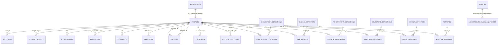

# VÔ TRI — Backend Architecture (Design)

> **Trạng thái:** thiết kế hoàn chỉnh, chưa triển khai lên hạ tầng thật.
> Toàn bộ SQL trong tài liệu này đã được viết ra thành migration thật ở
> `supabase/migrations/` và **verify cú pháp bằng cách chạy trên một
> Postgres 16 container tạm** (không phải chỉ đọc bằng mắt) — xem §9. Việc
> còn lại cần chủ dự án: tạo project Supabase thật, cung cấp Project URL/
> Anon Key/Service Role Key, rồi mới `supabase db push` migration thật lên
> đó và nối Auth vào frontend.
>
> Tài liệu này giả định người đọc đã đọc
> [`PROJECT_HANDOFF.md`](./PROJECT_HANDOFF.md) (đặc biệt §7 "Extension
> points" và §10 "Hướng phát triển đề xuất") và
> [`VO_TRI_ARCHITECTURE.md`](./VO_TRI_ARCHITECTURE.md). Không lặp lại nội
> dung frontend ở đây trừ khi cần thiết cho quyết định backend.

---

## 1. Mục tiêu & nguyên tắc thiết kế

1. **Mọi bảng phải map được về một prop shape/type đã tồn tại trong
   frontend** (`ProfileStats`, `QuestProgress`, `LeaderboardPlayer`,
   `FeedItem`, ... — xem §5 bảng mapping). Không thiết kế bảng cho tính
   năng chưa có UI thật.
2. **Không tin dữ liệu client gửi lên cho bất cứ thứ gì liên quan đến
   điểm/XP/phần thưởng.** Điểm/XP luôn được server tính lại từ công thức
   gốc (`game/scoring.ts`), không bao giờ nhận thẳng số client báo. Đây là
   nguyên tắc bảo mật quan trọng nhất của thiết kế này — xem §7.
3. **RLS là lớp phòng thủ cuối, không phải lớp nghiệp vụ chính.** Logic
   nghiệp vụ (tính điểm, kiểm tra giới hạn/cooldown, cộng dồn tiến độ
   quest) nằm ở service layer (Server Actions chạy trên server), không
   nằm trong policy RLS. RLS đảm bảo: kể cả khi service layer có bug hoặc
   ai đó gọi thẳng Supabase client, họ vẫn không thể đọc/ghi dữ liệu của
   người khác.
4. **Catalog nội dung (activity/quest/milestone/badge/achievement) vẫn
   sống trong code frontend** (`activities.ts`, `quests.ts`,
   `milestones.ts`...) — đây là nội dung thiết kế game thật, không phải
   dữ liệu runtime. DB chỉ có bảng "mirror" nhẹ (id + field cần thiết cho
   FK/truy vấn) được seed từ đúng catalog đó, để có referential integrity
   thật khi join với bảng tiến độ người dùng.
5. **Không tạo bảng/migration cho thứ chưa có nhu cầu thật.** Ví dụ:
   không có bảng "sessions" riêng (Supabase Auth đã quản lý), không có
   materialized view cho leaderboard (chưa có traffic thật để cần tối ưu
   đó) — ghi rõ "chưa cần, đây là đường nâng cấp sau" thay vì xây trước.
6. **Migration một chiều, không phá dữ liệu.** Không bao giờ đổi kiểu cột
   phá hoại hoặc xoá cột có dữ liệu trong cùng một migration với việc
   thêm tính năng mới — xem §8.

---

## 2. Lựa chọn nền tảng: Supabase

**Quyết định: dùng Supabase**, đúng như CLAUDE.md's cost rules đã định
hướng ("free-tier Postgres") và `PROJECT_HANDOFF.md` §10 đã đề xuất.

Lý do cụ thể (không chỉ vì được yêu cầu ưu tiên, mà vì nó thật sự khớp
nhu cầu):

- **Một dịch vụ, ba nhu cầu:** Auth (email/password + OAuth sẵn có) +
  Postgres thật (không phải NoSQL — schema quan hệ rất rõ ràng cho
  Profile/Quest/Leaderboard) + Storage (cho avatar sau này) trong cùng
  một free tier, không cần ghép 3 nhà cung cấp khác nhau.
- **Row Level Security là Postgres RLS thật**, không phải một lớp
  authorization tự chế — khớp trực tiếp với nguyên tắc #3 ở trên.
- **`@supabase/ssr`** hỗ trợ Next.js App Router cookie-based session
  natively (Server Components, Server Actions, Middleware đều đọc được
  session) — không cần tự viết JWT refresh logic.
- **Migration là SQL file thật** (`supabase/migrations/*.sql`), không
  phải một ORM schema trừu tượng — dễ audit, dễ review diff, khớp
  nguyên tắc #6.
- Next.js Server Actions chạy trong cùng Node.js runtime với phần còn lại
  của codebase → service layer có thể import thẳng các module dùng chung
  đã có sẵn (`copy/microcopy.ts` cho nội dung notification/lỗi đúng
  giọng brand, `profile/ranks.ts` cho rank label...) thay vì viết lại
  logic đó lần hai ở một service riêng biệt.

**Không có quyết định nào tốt hơn được cân nhắc mà không dùng** — các lựa
chọn khác (Firebase, PlanetScale + NextAuth riêng, tự host Postgres) đều
hoặc đắt hơn ở free tier, hoặc cần ghép nhiều dịch vụ hơn cho cùng chức
năng, hoặc không có RLS Postgres thật.

---

## 3. Tổng quan ERD


```mermaid
erDiagram
    AUTH_USERS ||--|| PROFILES : "1:1 (trigger tạo tự động)"
    PROFILES ||--o{ ACTIVITY_SESSIONS : "chơi"
    PROFILES ||--o{ DAILY_ACTIVITY_LOG : "hoạt động mỗi ngày"
    PROFILES ||--o{ XP_LEDGER : "nhận điểm/XP"
    PROFILES ||--o{ QUEST_PROGRESS : "tiến độ quest"
    PROFILES ||--o{ MILESTONE_PROGRESS : "tiến độ milestone"
    PROFILES ||--o{ USER_ACHIEVEMENTS : "mở khoá"
    PROFILES ||--o{ USER_BADGES : "mở khoá"
    PROFILES ||--o{ USER_COLLECTION_ITEMS : "mở khoá"
    PROFILES ||--o{ FOLLOWS : "follower_id"
    PROFILES ||--o{ FOLLOWS : "followee_id"
    PROFILES ||--o{ REACTIONS : "thả cảm xúc"
    PROFILES ||--o{ COMMENTS : "viết"
    PROFILES ||--o{ FEED_ITEMS : "actor_id (hệ thống tạo)"
    PROFILES ||--o{ NOTIFICATIONS : "nhận"
    PROFILES ||--o{ JOURNEY_EVENTS : "dòng thời gian"
    PROFILES ||--o{ AUDIT_LOG : "actor_id"

    ACTIVITIES ||--o{ ACTIVITY_SESSIONS : "activity_id"
    QUEST_DEFINITIONS ||--o{ QUEST_PROGRESS : "quest_id"
    MILESTONE_DEFINITIONS ||--o{ MILESTONE_PROGRESS : "milestone_id"
    ACHIEVEMENT_DEFINITIONS ||--o{ USER_ACHIEVEMENTS : "achievement_id"
    BADGE_DEFINITIONS ||--o{ USER_BADGES : "badge_id"
    COLLECTION_DEFINITIONS ||--o{ USER_COLLECTION_ITEMS : "item_id"
    SEASONS ||--o{ LEADERBOARD_RANK_SNAPSHOTS : "season_id (khi scope=season)"
```

24 bảng, chia 8 nhóm chức năng (chi tiết cột ở §4):

| Nhóm | Bảng |
|---|---|
| Danh tính | `profiles` |
| Catalog (mirror từ code) | `activities`, `quest_definitions`, `milestone_definitions`, `achievement_definitions`, `badge_definitions`, `collection_definitions`, `seasons` |
| Gameplay & kinh tế thưởng | `activity_sessions`, `daily_activity_log`, `xp_ledger` |
| Retention | `quest_progress`, `milestone_progress` |
| Unlock | `user_achievements`, `user_badges`, `user_collection_items` |
| Xã hội | `follows`, `reactions`, `comments`, `feed_items` |
| Thông báo & timeline | `notifications`, `journey_events` |
| Xếp hạng & vận hành | `leaderboard_rank_snapshots`, `audit_log` |

---

## 4. Schema chi tiết

Quy ước: `snake_case`, `timestamptz` cho mọi thời điểm, `gen_random_uuid()`
làm PK mặc định (built-in từ Postgres 13+, không cần extension). Bảng
catalog dùng `id text` (khớp id string trong code, ví dụ `"diem-danh"`)
thay vì `uuid`, để mirror đúng 1-1 với catalog code.

### 4.1 `profiles` — mở rộng `auth.users`

```sql
create table public.profiles (
  id uuid primary key references auth.users(id) on delete cascade,
  username citext unique not null,
  display_name text not null,
  avatar_url text,
  tagline text,
  -- Kinh tế thưởng — nguồn sự thật là xp_ledger/activity_sessions,
  -- các cột dưới đây là cache đã denormalize để đọc nhanh (leaderboard,
  -- Profile, Home đều cần đọc điểm/level cực nhanh, không thể SUM() mỗi lần).
  points integer not null default 0,
  total_xp_earned bigint not null default 0,
  level integer not null default 1,
  xp integer not null default 0,        -- tiến độ trong level hiện tại
  xp_to_next integer not null default 50,
  current_streak integer not null default 0,
  longest_streak integer not null default 0,
  last_active_date date,
  total_active_days integer not null default 0,
  total_activities_played integer not null default 0,
  joined_at timestamptz not null default now(),
  updated_at timestamptz not null default now()
);
```

Ánh xạ trực tiếp: `ProfileIdentity` (displayName/username/avatarUrl/
tagline/joinedAt) + `ProfileStats` (points/level/xp/streakDays/activeDays/
activitiesPlayed) + `LevelProgress` (level/xp/xpToNext). `online` field
của `ProfileIdentity` **không lưu DB** — đây là trạng thái tức thời (ai
đang mở app), thuộc về Supabase Realtime Presence sau này, không phải một
cột persist (xem §10, mục "chưa cần").

`username` dùng kiểu `citext` (case-insensitive text — cần bật extension
`citext`) để "AnDuy" và "anduy" là cùng một username, tránh username giả
mạo bằng cách đổi hoa/thường.

**Tự động tạo khi đăng ký** — không có INSERT policy cho client (xem
§6.1), chỉ trigger sau khi `auth.users` có row mới:

```sql
create function public.handle_new_user()
returns trigger
language plpgsql
security definer set search_path = public
as $$
begin
  insert into public.profiles (id, username, display_name)
  values (
    new.id,
    coalesce(new.raw_user_meta_data->>'username', 'user_' || substr(new.id::text, 1, 8)),
    coalesce(new.raw_user_meta_data->>'display_name', 'Người Vô Tri Mới')
  );
  return new;
end;
$$;

create trigger on_auth_user_created
  after insert on auth.users
  for each row execute function public.handle_new_user();
```

Username mặc định là placeholder tự sinh (`user_xxxxxxxx`) nếu người
dùng không cung cấp — tránh trạng thái "profile chưa có username" mà
`citext unique not null` sẽ chặn.

### 4.2 Catalog (mirror từ code, seed qua migration)

```sql
create table public.activities (
  id text primary key,               -- khớp Activity.id trong activities.ts
  name text not null,
  category text not null,
  difficulty text not null check (difficulty in ('de','vua','kho')),
  reward integer not null,
  xp integer not null,
  daily_limit integer,
  cooldown_minutes integer,
  is_coming_soon boolean not null default false,
  updated_at timestamptz not null default now()
);

create table public.quest_definitions (
  id text primary key,
  cadence text not null check (cadence in ('daily','weekly')),
  target integer not null,
  reward integer not null,
  xp integer not null
);

create table public.milestone_definitions (
  id text primary key,
  metric text not null check (metric in ('streak','activitiesPlayed')),
  threshold integer not null
);

create table public.achievement_definitions (
  id text primary key,
  name text not null,
  description text not null
);

create table public.badge_definitions (
  id text primary key,
  name text not null,
  description text not null,
  rarity text not null check (rarity in ('common','rare','special'))
);

create table public.collection_definitions (
  id text primary key,
  name text not null,
  kind text not null check (kind in ('skin','title','item'))
);

create table public.seasons (
  id uuid primary key default gen_random_uuid(),
  name text not null,
  starts_at timestamptz not null,
  ends_at timestamptz not null
);
```

**Không lưu `icon`** trong bất kỳ bảng catalog nào — `LucideIcon` là một
component reference, không thể serialize vào DB (đúng lỗi RSC boundary
đã gặp nhiều lần, xem `VO_TRI_ARCHITECTURE.md`'s "Recurring RSC gotcha").
Frontend tiếp tục map `id` → icon qua chính catalog code hiện có
(`activities.ts`, `reactions.ts`...), backend chỉ cần trả về `id`.

Seed data cho các bảng này **idempotent** (`insert ... on conflict (id) do
update`) để sửa `quests.ts`/`activities.ts` trong code và re-run migration
không bị lỗi trùng khoá hay tạo bản ghi ma — xem §8.

### 4.3 Gameplay & kinh tế thưởng

```sql
create table public.activity_sessions (
  id uuid primary key default gen_random_uuid(),
  user_id uuid not null references public.profiles(id) on delete cascade,
  activity_id text not null references public.activities(id),
  kind text not null check (kind in ('win','lose','complete','timeout','abandoned')),
  client_reported_points integer,   -- giữ lại để đối chiếu/phát hiện gian lận, KHÔNG dùng để cộng điểm
  awarded_points integer not null,  -- số điểm THẬT SỰ được cộng, do server tính (xem §7)
  awarded_xp integer not null,
  combo_max integer not null default 0,
  duration_seconds integer not null default 0,
  created_at timestamptz not null default now()
);
create index on public.activity_sessions (user_id, created_at desc);
create index on public.activity_sessions (user_id, activity_id, created_at desc);

create table public.daily_activity_log (
  user_id uuid not null references public.profiles(id) on delete cascade,
  activity_date date not null,
  primary key (user_id, activity_date)
);

create table public.xp_ledger (
  id uuid primary key default gen_random_uuid(),
  user_id uuid not null references public.profiles(id) on delete cascade,
  source text not null check (source in ('activity_session','quest_claim','milestone_claim')),
  source_id uuid,                   -- id của activity_session / quest_progress / milestone_progress liên quan
  points integer not null default 0,
  xp integer not null default 0,
  created_at timestamptz not null default now()
);
create index on public.xp_ledger (user_id, created_at desc);
```

`activity_sessions` là backing store cho `SessionStats` (attempts =
`count(*)`, bestScore = `max(awarded_points)`, durationSeconds = phiên gần
nhất) — nhưng lưu ý: `SessionStats` trong `game/types.ts` hiện là
**client-only, reset khi reload** (theo thiết kế của Gameplay Engine,
xem `VO_TRI_GAMEPLAY_ENGINE.md` §7) — bảng này KHÔNG thay thế
`SessionStats` phía client, nó là nguồn dữ liệu **lifetime** cho
`ProfileStats.activitiesPlayed` và cho Leaderboard theo scope
week/month/season sau này (query theo `created_at` range).

`daily_activity_log` là nguồn sự thật cho streak — một dòng nghĩa là
"user có hoạt động thật trong ngày đó" (chèn khi có `activity_sessions`
mới hoặc check-in). `StreakTracker.last7Days` được suy ra bằng một truy
vấn 7 ngày gần nhất trên bảng này, không lưu mảng boolean riêng.

### 4.4 Retention (Quest/Milestone)

```sql
create table public.quest_progress (
  user_id uuid not null references public.profiles(id) on delete cascade,
  quest_id text not null references public.quest_definitions(id),
  period_key date not null,   -- daily: chính ngày đó; weekly: thứ Hai đầu tuần (ISO)
  current_value integer not null default 0,
  claimed_at timestamptz,
  updated_at timestamptz not null default now(),
  primary key (user_id, quest_id, period_key)
);

create table public.milestone_progress (
  user_id uuid not null references public.profiles(id) on delete cascade,
  milestone_id text not null references public.milestone_definitions(id),
  reached_at timestamptz,    -- server phát hiện đã vượt threshold
  claimed_at timestamptz,    -- người dùng đã bấm "Nhận thưởng"
  primary key (user_id, milestone_id)
);
```

`milestone_progress` **không lưu `current`** — giá trị hiện tại luôn suy
ra từ `profiles.current_streak`/`profiles.total_activities_played` so với
`milestone_definitions.threshold` tại thời điểm đọc (tránh hai nguồn sự
thật lệch nhau). Chỉ `reached_at`/`claimed_at` cần persist vì đó là sự
kiện, không phải giá trị suy ra được.

`quest_progress.period_key` là chìa khoá của cơ chế "reset mỗi ngày/tuần"
— một dòng mới cho mỗi chu kỳ thay vì UPDATE dòng cũ, nên lịch sử các chu
kỳ trước tự động trở thành dữ liệu lịch sử cho `journey_events`/audit,
không cần bảng riêng.

### 4.5 Unlock (Achievement/Badge/Collection)

```sql
create table public.user_achievements (
  user_id uuid not null references public.profiles(id) on delete cascade,
  achievement_id text not null references public.achievement_definitions(id),
  unlocked_at timestamptz not null default now(),
  primary key (user_id, achievement_id)
);

create table public.user_badges (
  user_id uuid not null references public.profiles(id) on delete cascade,
  badge_id text not null references public.badge_definitions(id),
  unlocked_at timestamptz not null default now(),
  primary key (user_id, badge_id)
);

create table public.user_collection_items (
  user_id uuid not null references public.profiles(id) on delete cascade,
  item_id text not null references public.collection_definitions(id),
  unlocked_at timestamptz not null default now(),
  primary key (user_id, item_id)
);
```

Giữ 3 bảng riêng thay vì gộp thành một bảng "unlockables" chung — vì
frontend đã cố ý tách `Achievement`/`ProfileBadge`/`CollectionItem` thành
3 type và 3 section khác nhau trên Profile (`AchievementSection`,
`BadgeCollection`, `CollectionShowcase`), mirror đúng ranh giới đó thay vì
ép gộp cho "DRY" giả tạo — đúng nguyên tắc tổ chức mã nguồn #2 trong
`PROJECT_HANDOFF.md`.

### 4.6 Xã hội

```sql
create table public.follows (
  follower_id uuid not null references public.profiles(id) on delete cascade,
  followee_id uuid not null references public.profiles(id) on delete cascade,
  created_at timestamptz not null default now(),
  primary key (follower_id, followee_id),
  check (follower_id <> followee_id)
);

create table public.reactions (
  id uuid primary key default gen_random_uuid(),
  user_id uuid not null references public.profiles(id) on delete cascade,
  target_type text not null check (target_type in ('feed_item','comment')),
  target_id uuid not null,
  reaction_id text not null check (reaction_id in ('thich','cuoi','dinh','bat-ngo','vo-tri')),
  created_at timestamptz not null default now(),
  unique (user_id, target_type, target_id)
);

create table public.comments (
  id uuid primary key default gen_random_uuid(),
  target_type text not null check (target_type in ('activity','feed_item')),
  target_id text not null,
  author_id uuid not null references public.profiles(id) on delete cascade,
  parent_comment_id uuid references public.comments(id) on delete cascade,
  body text not null check (char_length(body) between 1 and 1000),
  created_at timestamptz not null default now(),
  deleted_at timestamptz
);
create index on public.comments (target_type, target_id, created_at desc);

create table public.feed_items (
  id uuid primary key default gen_random_uuid(),
  actor_id uuid not null references public.profiles(id) on delete cascade,
  event_type text not null check (event_type in ('level_up','milestone','achievement','quest_claim')),
  text text not null,
  created_at timestamptz not null default now()
);
create index on public.feed_items (created_at desc);
```

`reaction_id` dùng đúng 5 giá trị trong `social/reactions.ts`
(`thich`/`cuoi`/`dinh`/`bat-ngo`/`vo-tri`) — check constraint thay vì bảng
`reaction_kinds` riêng, vì bộ reaction là cố định trong brand voice, không
phải nội dung do người dùng/admin tạo thêm được (đổi = sửa code + một
migration mới, không cần bảng động cho việc hiếm khi xảy ra).

`feed_items.text` **không phải nội dung người dùng tự viết** — đây là mô
tả hệ thống tự sinh ("X vừa đạt Cao Thủ") khi có sự kiện thật (lên cấp/
milestone/thành tích/claim quest), đúng nguyên tắc "không dữ liệu giả":
feed chỉ chứa sự kiện thật, không có nút "đăng bài" nào trong frontend
hiện tại. `event_type` giới hạn đúng các sự kiện service layer thật sự
tạo ra (xem §9.3) — không cho phép insert tự do.

### 4.7 Thông báo & timeline

```sql
create table public.notifications (
  id uuid primary key default gen_random_uuid(),
  user_id uuid not null references public.profiles(id) on delete cascade,
  type text not null check (type in ('achievement','reward','friend','system')),
  title text not null,
  description text not null,
  read_at timestamptz,
  created_at timestamptz not null default now()
);
create index on public.notifications (user_id, created_at desc);

create table public.journey_events (
  id uuid primary key default gen_random_uuid(),
  user_id uuid not null references public.profiles(id) on delete cascade,
  type text not null check (type in ('joined','level-up','achievement','reward','quest','milestone','streak')),
  label text not null,
  occurred_at timestamptz not null default now()
);
create index on public.journey_events (user_id, occurred_at desc);
```

Cả hai bảng map 1-1 với `NotificationItem`/`JourneyEvent` — không cần
biến đổi gì thêm phía frontend khi nối dữ liệu thật.

### 4.8 Xếp hạng & vận hành

```sql
create table public.leaderboard_rank_snapshots (
  id uuid primary key default gen_random_uuid(),
  user_id uuid not null references public.profiles(id) on delete cascade,
  scope text not null check (scope in ('global','week','month','season')),
  season_id uuid references public.seasons(id),
  rank integer not null,
  points integer not null,
  captured_at timestamptz not null default now()
);
create index on public.leaderboard_rank_snapshots (scope, user_id, captured_at desc);

create table public.audit_log (
  id uuid primary key default gen_random_uuid(),
  actor_id uuid references public.profiles(id) on delete set null,
  action text not null,
  target_type text,
  target_id text,
  metadata jsonb not null default '{}'::jsonb,
  created_at timestamptz not null default now()
);
create index on public.audit_log (created_at desc);
```

`leaderboard_rank_snapshots` là nguồn cho `RankChangeIcon`
(`previousRank` = snapshot gần nhất trước snapshot hiện tại của cùng
scope) — bảng này **chỉ cần khi có snapshot job chạy**, xem §10 "chưa
triển khai — Phase sau" (không tạo cron job ngay vì chưa có traffic thật
để snapshot).

`audit_log` là log vận hành/bảo mật chung (khác `xp_ledger` — đó là log
"kinh tế" người dùng có thể tự xem; `audit_log` không lộ cho client, chỉ
đọc qua Supabase Dashboard hoặc một trang admin sau này).

---

## 5. Mapping: frontend type → bảng DB

| Frontend type | Nguồn | Bảng/cột DB |
|---|---|---|
| `VoTriUser` (shell/types.ts) | Header/Sidebar | View kết hợp `auth.users` + `profiles` (xem §9.2) |
| `ProfileIdentity` | profile/types.ts | `profiles.{username,display_name,avatar_url,tagline,joined_at}` |
| `ProfileStats` | profile/types.ts | `profiles.{points,level,xp,current_streak→streakDays,total_active_days→activeDays,total_activities_played→activitiesPlayed}` |
| `LevelProgress` | profile/types.ts | `profiles.{level,xp,xp_to_next}` |
| `TodayStats` | home/TodayCard.tsx | Kết hợp `profiles` + `StreakData` (xem dưới) |
| `StreakData` | retention/types.ts | `profiles.{current_streak,longest_streak}` + 7 dòng gần nhất của `daily_activity_log` |
| `Achievement[]` | profile/types.ts | `user_achievements` join `achievement_definitions` |
| `ProfileBadge[]` | profile/types.ts | `badge_definitions` left join `user_badges` (unlocked = có dòng join) |
| `CollectionItem[]` | profile/types.ts | `collection_definitions` left join `user_collection_items` |
| `JourneyEvent[]` | profile/types.ts | `journey_events` |
| `Activity[]` | explore/types.ts | Vẫn là `activities.ts` (code) — DB chỉ mirror cho FK |
| `QuestDefinition[]` + `QuestProgress` | retention/types.ts | `quest_definitions` (code mirror) + `quest_progress` |
| `MilestoneDefinition[]` + `MilestoneProgress` | retention/types.ts | `milestone_definitions` (code mirror) + `milestone_progress` |
| `ClaimResult` | retention/types.ts | Trả về từ RPC `claim_quest`/`claim_milestone` (xem §9.3), không phải một bảng |
| `LeaderboardPlayer[]` | leaderboard/types.ts | Query `profiles` `order by points desc` (scope=global) hoặc join `xp_ledger`/`follows` cho scope khác |
| `MyPosition` | leaderboard/types.ts | Tính từ cùng query trên, vị trí của `auth.uid()` |
| `RankChange` | leaderboard/types.ts | So sánh `leaderboard_rank_snapshots` mới nhất vs. gần nhất trước đó |
| `SessionStats` | game/types.ts | **Vẫn client-only theo thiết kế Engine** — không map DB. Lifetime stats dùng `activity_sessions` riêng |
| `GameOutcome` | game/types.ts | Server trả `awarded_points`/`awarded_xp` thật qua RPC `record_activity_session` |
| `FeedItem[]` | social/types.ts | `feed_items` join `profiles` (actor) |
| `NotificationItem[]` | social/types.ts | `notifications` |
| `CommentData[]` | social/types.ts | `comments` (self-join `parent_comment_id` cho replies) join `profiles` |
| `UserPreview` | social/types.ts | `profiles` + `getRank(level)` tính ở client/service, không lưu DB |
| `ReactionCounts` | social/types.ts | `select reaction_id, count(*) from reactions where target_type=... and target_id=... group by reaction_id` |

---

## 6. Security

### 6.1 Nguyên tắc chung

- **Bảng "sự kiện thô" (activity_sessions, xp_ledger, quest_progress,
  milestone_progress, notifications, audit_log): SELECT riêng tư** —
  chỉ chủ sở hữu (`auth.uid() = user_id`) đọc được, trừ `audit_log`
  (không client nào đọc được).
- **Bảng "hồ sơ công khai" (profiles, user_achievements, user_badges,
  user_collection_items, journey_events, follows, reactions, comments,
  feed_items): SELECT công khai** (`using (true)`) — đúng bản chất một
  sản phẩm cộng đồng/leaderboard, nơi hồ sơ người khác vốn phải xem được
  (Leaderboard, UserPreviewCard đã hiển thị điểm/level/badge của người
  khác từ trước).
- **INSERT/UPDATE cho dữ liệu có thể ảnh hưởng điểm/XP/phần thưởng: KHÔNG
  cho phép trực tiếp từ client**, kể cả khi RLS cho phép ghi vào đúng
  `user_id` của mình — luôn đi qua hàm `security definer` (§6.2), vì
  logic tính điểm/kiểm tra giới hạn nằm ở đó, không nằm ở policy.
- **Bảng catalog: SELECT công khai, không ai (kể cả chủ sở hữu) ghi
  được** qua client — catalog chỉ đổi qua migration.
- **INSERT/UPDATE/DELETE mặc định là DENY** — mọi bảng bật RLS
  (`enable row level security`), chỉ thêm policy cho đúng thao tác được
  phép, không có bảng nào "quên bật RLS" (lỗi phổ biến nhất trong dự án
  Supabase thật).

### 6.2 `security definer` — khi nào cần

Các thao tác sau **phải** đi qua một Postgres function `security definer`
(chạy với quyền của người tạo hàm, bỏ qua RLS bên trong, nhưng có kiểm
tra logic tường minh bên trong hàm) thay vì UPDATE/INSERT trực tiếp:

| Hàm | Việc nó làm | Vì sao không thể là policy đơn thuần |
|---|---|---|
| `record_activity_session(...)` | Kẹp điểm/XP client báo vào trần dựa trên catalog (§7), kiểm tra dailyLimit/cooldown, ghi `activity_sessions`+`xp_ledger`+`daily_activity_log`, cập nhật `profiles`, có thể tạo `feed_items`/`notifications`/`journey_events` nếu lên cấp | Nhiều bước kiểm tra/cập nhật theo chuỗi — không biểu diễn được bằng một `check` hay policy RLS đơn lẻ |
| `claim_quest(quest_id)` | Kiểm tra `current_value >= target` và `claimed_at is null`, cộng `reward`/`xp`, set `claimed_at` | Tránh client tự set `claimed_at` mà chưa đủ điều kiện |
| `claim_milestone(milestone_id)` | Tương tự, cộng thưởng cố định của milestone | Tương tự |
| `advance_quest_progress(...)` | Được gọi nội bộ bởi `record_activity_session` để cộng dồn tiến độ quest tương ứng (chơi 2 hoạt động, đạt 50 điểm...) | Logic điều kiện phức tạp theo loại quest |
| `toggle_follow(target_id)` | Insert/delete `follows`, kiểm tra không tự follow chính mình | Đơn giản nhưng gộp vào RPC để tương lai dễ thêm rate-limit |

Các bảng trên **không có INSERT/UPDATE policy nào cho vai trò
`authenticated`** — chỉ vai trò chạy các hàm `security definer` (định
nghĩa là `security definer` nghĩa là chạy với quyền `postgres`/owner của
hàm, không phải quyền người gọi) mới ghi được. Điều này chặn hoàn toàn
khả năng một client gọi thẳng `supabase.from('activity_sessions').insert(...)`
với điểm số tự bịa.

### 6.3 Storage — bucket `avatars`

```sql
insert into storage.buckets (id, name, public) values ('avatars', 'avatars', true);

create policy "avatar images are publicly readable"
  on storage.objects for select
  using (bucket_id = 'avatars');

create policy "users can upload their own avatar"
  on storage.objects for insert
  with check (
    bucket_id = 'avatars'
    and auth.uid()::text = (storage.foldername(name))[1]
  );

create policy "users can update their own avatar"
  on storage.objects for update
  using (
    bucket_id = 'avatars'
    and auth.uid()::text = (storage.foldername(name))[1]
  );
```

Quy ước path: `avatars/{user_id}/{filename}` — policy dùng
`storage.foldername(name)[1]` (thư mục con đầu tiên) để đảm bảo user chỉ
ghi được vào đúng thư mục mang uid của chính mình. Đọc thì công khai
(avatar hiển thị ở Header/comment/leaderboard cho mọi người xem).

### 6.4 Permission model tóm tắt

| Vai trò | Có thể |
|---|---|
| `anon` (chưa đăng nhập) | SELECT các bảng công khai (profiles, catalog, leaderboard, feed, comments...). Không ghi được gì. |
| `authenticated` (đã đăng nhập) | Thêm: SELECT dữ liệu riêng của chính mình (sessions, quest progress, notifications...); INSERT/UPDATE/DELETE đúng `auth.uid()` của mình ở các bảng cho phép (comments, reactions, follows); gọi mọi RPC `security definer` (RPC tự kiểm tra `auth.uid()` bên trong). |
| `service_role` (chỉ server-side, không bao giờ lộ ra client) | Bỏ qua RLS hoàn toàn — dùng cho: job snapshot leaderboard định kỳ, script seed/migrate, thao tác admin/moderation tương lai. |

---

## 7. Anti-cheat: không tin điểm số client báo

Đây là quyết định bảo mật quan trọng nhất của thiết kế, vì đây là dữ
liệu duy nhất trong sản phẩm có "giá trị" (điểm/XP/level/rank) — dù chưa
gắn với thanh toán thật, vẫn nên thiết kế đúng ngay từ đầu thay vì vá sau.

**Vì sao không thể "tính lại chính xác" phía server (và tại sao bản
nháp đầu của thiết kế này sai ở điểm đó):** `GameOutcome.points` không
phải kết quả của một công thức đóng theo `(comboMax, durationSeconds)` —
nó là tổng cộng dồn của nhiều lần gọi `ctx.addScore(basePoints)` trong
lúc chơi, mỗi lần áp dụng hệ số combo tại đúng thời điểm đó
(`GameFrame.tsx`'s `addScore`). Muốn server tái tạo chính xác số điểm đó,
cần log lại **toàn bộ chuỗi sự kiện** (mỗi lần `addScore`/`registerHit`/
`registerMiss` xảy ra) rồi replay ở server — điều này cần **sửa
`GameFrame`/`PlayClient` để ghi log sự kiện**, một thay đổi frontend thật
sự (không chỉ backend), nằm ngoài phạm vi "không đổi frontend nếu không
thật sự cần" của lượt này. Ghi nhận rõ đây là hướng nâng cấp tương lai
(xem cuối mục này), không phải thiếu sót bị bỏ quên.

Thực tế kiểm tra `PlayClient.tsx` (Activity thật duy nhất hiện có) còn
cho thấy: nút "Hoàn thành" gọi `ctx.complete({ points: activity.reward,
xp: activity.xp })` — dùng thẳng giá trị catalog cố định, không liên
quan gì đến điểm combo tích luỹ; còn nút demo "Thử thua" gọi
`ctx.lose({ points: ctx.score, xp: Math.round(activity.xp / 2) })` — cả
`points` lẫn `xp` đều có thể bị client chỉnh tuỳ theo nhánh UI nào được
gọi. Tức là **cả hai trường `points` và `xp` đều cần được coi là "client
tự báo", không có trường nào mặc định an toàn.**

**Thiết kế v1 (đủ dùng cho một game giải trí chưa gắn tiền thật, không
phải một hệ chống gian lận hoàn chỉnh — cố tình giới hạn phạm vi, ghi rõ
ở đây thay vì tự nhận là "đã giải quyết xong"):**

1. Client gọi Server Action `recordActivitySession({ activityId, kind,
   clientReportedPoints, clientReportedXp, comboMax, durationSeconds })`.
2. RPC `record_activity_session` (chạy trong Postgres, `authenticated`
   được phép gọi trực tiếp — xem vì sao an toàn ở dưới):
   - Đọc `reward`/`xp` thật của activity từ bảng `activities` bằng
     `activity_id` (giá trị duy nhất không thể client tự bịa, vì phải
     khớp một dòng có thật trong bảng catalog).
   - **Kẹp giá trị** thay vì tính lại chính xác:
     `awarded_points = least(clientReportedPoints, activities.reward * 3)`,
     `awarded_xp = least(clientReportedXp, activities.xp * 3)` — hệ số
     ×3 là biên rộng rãi có chủ đích (đủ chỗ cho combo/scoring thật sự
     vượt qua phần thưởng hoàn thành cơ bản), chặn đứng trường hợp cực
     đoan (client tự báo 999999 điểm cho một activity 15 điểm) mà không
     cần biết chính xác người chơi đã làm gì trong phiên.
   - Nếu `clientReportedPoints`/`clientReportedXp` bị kẹp lại (tức giá
     trị client báo cao hơn trần) → vẫn ghi `awarded_points`/`awarded_xp`
     đã kẹp, đồng thời ghi một dòng vào `audit_log`
     (action = `'score_clamped'`) để rà soát sau — không chặn người
     chơi, chỉ gắn cờ.
   - Kiểm tra `dailyLimit`/`cooldownMinutes` bằng cách đếm
     `activity_sessions` gần đây của đúng user+activity — đây mới là
     phần **chặn được chính xác 100%** (không có gì mơ hồ: đếm số dòng
     là phép toán chính xác), khác với phần điểm số ở trên (chỉ kẹp
     biên, không xác thực chính xác).
3. RPC trả về `awarded_points`/`awarded_xp`/`leveledUp?`/
   `milestoneReached?` thật — Server Action trả cho client để hiệu chỉnh
   `ResultScreen`/`RewardReveal` hiển thị đúng số đã ghi nhận.

**Vì sao RPC được phép gọi trực tiếp bởi `authenticated`** (không cần
service-role, không cần Server Action "giả danh" người dùng): vì RPC
không tin bất kỳ tham số nào của client làm giá trị cuối cùng — nó chỉ
dùng chúng làm **trần trên**, và tự tính trần đó hoàn toàn từ dữ liệu
catalog phía server. Một client gọi thẳng
`supabase.rpc('record_activity_session', {...})` với số cực lớn cũng chỉ
nhận được đúng trần cho phép, không hơn.

**Hướng nâng cấp tương lai (chưa cần bây giờ):** nếu sản phẩm gắn thanh
toán thật hoặc giải thưởng thật vào điểm số, nâng cấp đúng hướng là sửa
`GameFrame` ghi lại chuỗi sự kiện scoring thật (mỗi `addScore`/
`registerHit`/`registerMiss` kèm timestamp), gửi cả chuỗi lên, và RPC
replay chính xác bằng một bản port đầy đủ của `scoring.ts` trong SQL —
lúc đó phần "kẹp trần" ở trên trở thành lớp phòng thủ bổ sung, không còn
là cơ chế chính.

---

## 8. Migration strategy

### 8.1 Cấu trúc file

```
supabase/
  config.toml                 cấu hình dev local (project_id, ports...)
  migrations/
    20260724000001_extensions_and_helpers.sql
    20260724000002_profiles.sql
    20260724000003_catalog_tables.sql
    20260724000004_gameplay.sql
    20260724000005_retention.sql
    20260724000006_unlocks.sql
    20260724000007_social.sql
    20260724000008_notifications.sql
    20260724000009_leaderboard.sql
    20260724000010_audit.sql
    20260724000011_storage.sql
    20260724000012_functions.sql
```

Một migration = một nhóm chức năng liên quan (không phải một bảng/file —
quá vụn sẽ khó review; không phải một file khổng lồ — khó rollback từng
phần). Áp dụng tuần tự bằng `supabase db push` (khi đã có project thật) —
xem §11 phần cần chủ dự án.

File thứ 12 (`functions.sql`) tách riêng khỏi các migration tạo bảng ở
trên một cách có chủ đích: mọi hàm `security definer` liệt kê ở §6.2
(`record_activity_session`, `claim_quest`, `claim_milestone`,
`advance_quest_progress`, `toggle_follow`) đều ghi vào bảng của **nhiều
nhóm khác nhau** cùng lúc (ví dụ `record_activity_session` ghi cả
`activity_sessions` lẫn `notifications`/`journey_events`/`feed_items`/
`audit_log`) — đặt hàm cùng migration với bảng của riêng nhóm đó sẽ tạo
forward-reference tới bảng của một migration chưa chạy tới. Gom toàn bộ
hàm cross-cutting vào một migration cuối cùng, chạy sau khi mọi bảng đã
tồn tại, tránh lỗi này triệt để.

### 8.2 Quy tắc không phá dữ liệu (bắt buộc cho mọi migration sau này)

1. **Thêm cột mới:** luôn `nullable` hoặc có `default` — không bao giờ
   thêm cột `not null` vào bảng đã có dữ liệu mà không kèm default.
2. **Đổi tên cột/bảng:** không đổi tên trực tiếp. Thêm cột/bảng mới →
   backfill dữ liệu → chuyển toàn bộ code sang dùng tên mới → xoá tên cũ
   ở một migration **riêng, sau** (tối thiểu một release sau).
3. **Đổi kiểu cột:** dùng `alter table ... alter column ... type ... using
   ...` chỉ khi kiểu mới tương thích ngược hoàn toàn; nếu không, làm theo
   quy trình thêm-cột-mới ở trên.
4. **Xoá cột/bảng:** chỉ trong migration riêng, sau khi xác nhận không
   còn code nào tham chiếu (grep toàn bộ `src/` trước khi xoá).
5. **Seed data catalog:** luôn `insert ... on conflict (id) do update set
   ... `, không bao giờ `delete` rồi `insert` lại (sẽ xoá luôn các dòng
   con tham chiếu qua FK nếu thiếu `on delete cascade` đúng chỗ, hoặc mất
   `id` ổn định nếu lỡ dùng `uuid` ngẫu nhiên thay vì `text` cố định —
   đây là lý do §4.2 chọn `id text` cho toàn bộ bảng catalog).
6. **Policy RLS:** an toàn để lặp (`drop policy if exists ... ; create
   policy ...`) trong bất kỳ migration nào — không có rủi ro dữ liệu.

### 8.3 Đồng bộ catalog code ↔ DB

Khi một prompt tương lai thêm Activity/Quest/Milestone mới vào
`activities.ts`/`quests.ts`/`milestones.ts`, **bắt buộc** thêm một
migration mới seed đúng row tương ứng vào bảng mirror (không tự động —
đây là một bước thủ công có chủ đích, để tránh catalog DB âm thầm lệch
code mà không ai để ý). Đề xuất: một script nhỏ
(`scripts/generate-catalog-seed.ts`, chưa xây — thuộc Phase sau) đọc
trực tiếp `activities.ts` và in ra SQL `insert ... on conflict` để dán
vào migration mới, giảm khả năng gõ tay sai giá trị.

---

## 9. API Design

### 9.1 Lựa chọn: Next.js Server Actions làm write path chính

**Quyết định:** dùng **Server Actions** (không phải Route Handlers riêng,
không phải gọi thẳng Supabase client từ trình duyệt) cho mọi thao tác
ghi dữ liệu.

Lý do:
- Không có nhu cầu API RESTful cho bên thứ ba (không có app mobile/đối
  tác nào cần gọi vào) — xây một tầng Route Handler riêng lúc này là
  chuẩn bị cho một nhu cầu chưa tồn tại (vi phạm nguyên tắc #5).
- Server Action chạy trong Node.js runtime của Next.js — cho phép service
  layer **import thẳng code frontend hiện có** (`microcopy.ts` cho copy
  trong notification/lỗi, `ranks.ts` cho rank label...) thay vì viết lại
  logic ở một service riêng biệt.
- Tích hợp tự nhiên với các Client Component hiện có (`QuestCard`,
  `PlayClient`...) qua `useTransition`/form action, không cần thêm lớp
  fetch/loading state thủ công.

Đọc dữ liệu (reads) không nhất thiết qua Server Action — Server Component
gọi thẳng repository layer (§9.2) là đủ.

### 9.2 Kiến trúc 3 lớp

```
src/vo-tri/server/
  supabase/
    server-client.ts     Supabase client đọc cookie session (dùng trong Server Component/Action)
    admin-client.ts       Supabase client dùng service-role key (CHỈ dùng trong job nội bộ, không bao giờ import vào code chạy theo request của client)
    types.ts               Kiểu DB sinh ra (ban đầu viết tay khớp schema, sau này regenerate bằng `supabase gen types typescript`)
  repositories/
    profile-repository.ts        Query thô: getProfileById, getProfileByUsername, updateProfile...
    leaderboard-repository.ts     getGlobalLeaderboard, getMyPosition...
    quest-repository.ts           getQuestProgress, ...
    ... (một file / domain, khớp domain frontend hiện có)
  services/
    activity-session-service.ts   recordActivitySession() — gọi scoring.ts + repository + RPC
    quest-service.ts               claimQuest(), tính toán hiển thị QuestProgress
    profile-service.ts             updateProfile() với validate (trùng ranks.ts's tinh thần)
    ...
  actions/
    activity-actions.ts    "use server" — recordActivitySessionAction(formData/args), gọi service
    quest-actions.ts        claimQuestAction(), claimMilestoneAction()
    profile-actions.ts      updateProfileAction()
    social-actions.ts        toggleFollowAction(), reactAction(), postCommentAction()
```

- **`repositories/`** — chỉ query Supabase, không có nghiệp vụ, không
  validate (ngoại trừ kiểu dữ liệu). Đổi ORM/nhà cung cấp sau này chỉ sửa
  ở đây.
- **`services/`** — nghiệp vụ thật: validate, gọi nhiều repository, gọi
  RPC `security definer`, quyết định có tạo `notification`/`feed_item`
  hay không.
- **`actions/`** — lớp `"use server"` mỏng, chỉ parse input từ Client
  Component và gọi đúng một hàm service, bắt lỗi và trả về dạng
  `{ ok: true, data } | { ok: false, error }` nhất quán (không throw ra
  Client Component — Next.js Server Action ném lỗi thô sẽ hiện thông báo
  lỗi mặc định xấu, không đúng brand voice).

`VoTriUser`/`currentUser` — pattern hiện tại ở `src/app/page.tsx` (biến
cục bộ `undefined`) sẽ được thay bằng một hàm dùng chung
`getCurrentUser()` trong `server/supabase/server-client.ts`, đọc session
qua `@supabase/ssr`, trả `null` khi chưa đăng nhập — mọi Server Component
route hiện đang check `currentUser &&` chỉ cần đổi nguồn biến, không đổi
cấu trúc component.

### 9.3 Error handling & validation

- **Validation input** ở lớp `actions/` bằng `zod` (thêm dependency mới,
  nhẹ, chuẩn hệ sinh thái Next.js) — schema khớp chính xác tham số mỗi
  action, trả lỗi tiếng Việt đúng giọng brand (tái dùng
  `copy/microcopy.ts`'s `errorCopy`, không viết message mới rời rạc).
- **Lỗi nghiệp vụ** (quest chưa đủ điều kiện claim, vượt dailyLimit...)
  service layer trả `{ ok: false, error: { code, message } }` — không
  throw exception cho lỗi nghiệp vụ dự kiến trước (chỉ throw cho lỗi hạ
  tầng thật sự bất thường, ví dụ mất kết nối DB).
- **Lỗi hạ tầng** (Supabase down, timeout) — action bắt exception, log
  vào một service logging (chưa chọn provider, xem
  `PROJECT_HANDOFF.md` §7 "Analytics" extension point — có thể dùng
  chung điểm nối đó), trả về lỗi chung chung qua `errorCopy.generic`,
  không lộ chi tiết kỹ thuật cho người dùng.
- **RPC `security definer`** luôn `raise exception` bằng message có cấu
  trúc (`'QUEST_ALREADY_CLAIMED'`, `'DAILY_LIMIT_EXCEEDED'`...) — service
  layer bắt bằng mã lỗi Postgres, map sang message tiếng Việt đúng brand,
  không để nguyên exception SQL lộ ra UI.

---

## 10. Việc cố tình CHƯA thiết kế (đường nâng cấp sau, không phải thiếu sót)

- **Materialized view / snapshot job cho leaderboard** — chưa có traffic
  thật để cần tối ưu, `select ... order by points desc limit n` đơn
  giản là đủ ở quy mô hiện tại. Snapshot job (cho `RankChangeIcon`) là
  việc đầu tiên cần làm khi có người dùng thật.
- **Presence/online status thật** — `ProfileIdentity.online` cần
  Supabase Realtime Presence, một tính năng riêng, không phải một cột DB
  — để lại cho một milestone xã hội sau.
- **Season lifecycle tự động** (tự đóng mùa, tự tạo mùa mới) — bảng
  `seasons` đã có, nhưng job tự động chuyển mùa chưa cần cho tới khi có
  ít nhất một mùa giải chạy thật.
- **Rate limiting tầng hạ tầng** (chặn brute-force theo IP) — nằm ngoài
  phạm vi schema/RLS, thuộc cấu hình Supabase Auth (đã có rate limit mặc
  định) hoặc middleware sau này nếu cần chặt hơn.
- **Xoá tài khoản (account deletion)** — chưa có UI yêu cầu tính năng
  này; khi cần, thiết kế soft-delete (`profiles.deleted_at`) thay vì xoá
  cứng, để không phá vỡ `activity_sessions`/`comments` đã tham chiếu.
- **Trang admin/moderation** — `audit_log` đã sẵn sàng làm nguồn dữ liệu,
  nhưng chưa xây UI đọc nó (dùng Supabase Dashboard SQL editor tạm thời).

---

## 11. Cần chủ dự án trước khi đi tiếp

Thiết kế + migration SQL (đã verify cú pháp, xem §12) đã sẵn sàng, nhưng
**không thể áp dụng lên hạ tầng thật hay nối Auth vào frontend** cho tới
khi có:

1. **Một project Supabase thật** — chủ dự án tạo tại supabase.com (free
   tier) hoặc cung cấp project đã có sẵn.
2. **Project URL** + **Anon (public) Key** — để frontend/Server Component
   kết nối.
3. **Service Role Key** — chỉ dùng ở job nội bộ (snapshot leaderboard...),
   phải được lưu như một secret server-side, không bao giờ lộ ra
   `NEXT_PUBLIC_*`.
4. **Cấu hình biến môi trường thật** trên môi trường deploy (Vercel hoặc
   nơi chủ dự án chọn) — `NEXT_PUBLIC_SUPABASE_URL`,
   `NEXT_PUBLIC_SUPABASE_ANON_KEY`, `SUPABASE_SERVICE_ROLE_KEY`.
5. Sau khi có 1–4: chạy `supabase link` + `supabase db push` để áp dụng
   toàn bộ migration ở §8.1 lên project thật, rồi tôi mới có thể nối Auth
   UI thật (đăng nhập/đăng ký) vào `LoginButton`/`Header` và thay các
   nhánh `currentUser === undefined` bằng session thật.

Cho tới lúc đó, tôi sẽ chuẩn bị sẵn phần code **không cần credentials
thật để viết** (client factory, biến môi trường mẫu, kiểu TypeScript từ
schema) — xem §12.

---

## 12. Đã triển khai trong lượt này (không cần credentials)

- `supabase/migrations/*.sql` — toàn bộ schema + RLS ở §4–§7, **đã chạy
  thật trên một Postgres 16 cục bộ** (gói `postgresql-16` cài qua `apt`,
  không phải Docker — image Docker Hub bị chặn bởi chính sách mạng của
  session này, xem Phụ lục ở cuối tài liệu), với `auth.*`/`storage.*`/
  vai trò `anon`/`authenticated`/`service_role` được stub tối thiểu để mô
  phỏng đúng môi trường Supabase thật. Không chỉ chạy DDL — đã thực thi
  một smoke test thật kiểm tra: trigger tự tạo profile, `record_activity_session`
  cộng đúng điểm/XP/level/streak, quest_progress cộng dồn đúng cho cả 7
  quest liên quan trong 1 lần, `dailyLimit` chặn đúng lần thứ 2 trong
  ngày, **cơ chế kẹp trần chống gian lận hoạt động đúng** (báo điểm
  999999 → bị kẹp về đúng trần, có ghi `audit_log`), `claim_quest`/
  `claim_milestone` chặn đúng các điều kiện chưa đủ, RLS cách ly đúng dữ
  liệu giữa 2 user, và `anon` đọc được dữ liệu công khai nhưng không gọi
  được RPC đặc quyền. Toàn bộ kết quả khớp kỳ vọng — xem Phụ lục ở cuối
  tài liệu để biết chi tiết từng bước.
- `src/vo-tri/server/supabase/{server-client,admin-client}.ts` — client
  factory đọc `NEXT_PUBLIC_SUPABASE_URL`/`NEXT_PUBLIC_SUPABASE_ANON_KEY`/
  `SUPABASE_SERVICE_ROLE_KEY`, báo lỗi rõ ràng ("chưa cấu hình biến môi
  trường") thay vì lỗi runtime khó hiểu khi các biến đó chưa tồn tại —
  cùng tinh thần "no-op cho tới khi có thật" như `lib/sound.ts`/
  `lib/analytics.ts` đã làm.
- `src/vo-tri/server/supabase/database.types.ts` — kiểu TypeScript viết
  tay khớp chính xác schema ở §4, để service/repository layer sau này
  typecheck được ngay cả trước khi có project thật để chạy
  `supabase gen types typescript` (lệnh đó sẽ **thay thế** file này bằng
  bản tự sinh, không phải giữ song song).
- `.env.example` — liệt kê đúng 3 biến môi trường cần thiết, có comment
  giải thích biến nào public/an toàn lộ ra client, biến nào tuyệt đối
  không.
- `src/middleware.ts` — refresh session cookie theo đúng pattern
  `@supabase/ssr`; cũng no-op hoàn toàn khi chưa có 2 biến
  `NEXT_PUBLIC_SUPABASE_*`, xác nhận qua `next build` (không xuất hiện
  dòng "ƒ Middleware" cho tới khi file đặt đúng chỗ — lưu ý thật đã gặp:
  dự án dùng cấu trúc `src/`, nên `middleware.ts` phải nằm ở
  `src/middleware.ts`, **không phải** root repo, nếu không Next.js không
  nhận diện file này ở tất cả).
- `package.json` — thêm `@supabase/supabase-js` + `@supabase/ssr` + `zod`.
- Verify sau khi thêm toàn bộ file trên: `tsc`/`eslint`/`next build`
  sạch, cả 16 test Playwright hiện có (bao gồm middleware no-op) vẫn
  pass, `vitest run` vẫn 30/30 — không có gì trong app hiện tại bị ảnh
  hưởng bởi các file chuẩn bị này.

**Cố tình CHƯA viết** ở Phase 1: `repositories/`/`services/`/`actions/`
thật (logic nghiệp vụ) — vì viết mà không có project thật để chạy
`typecheck` lẫn thử nghiệm request thật sẽ là code "chưa từng được xác
minh" nằm im trong repo. **Quyết định này đã được chủ dự án ghi đè tường
minh ở đầu Phase 2** (yêu cầu chuẩn bị toàn bộ repositories/services/
actions ngay, chấp nhận rằng chúng chỉ verify được bằng
typecheck/lint/unit test cho tới khi có credentials thật, miễn là ranh
giới phụ thuộc credentials được cô lập rõ ràng) — xem §13.

---

## 13. Phase 2 — Supabase Integration Prep (đã triển khai, chưa nối credentials thật)

Toàn bộ mục này viết theo chỉ đạo tường minh của chủ dự án: chuẩn bị hết
mọi thứ *không phụ thuộc credentials* ngay bây giờ, để khi có Project
URL/Anon Key/Service Role Key thì việc nối dây diễn ra nhanh và ít rủi ro
nhất — không phải lập kế hoạch lại.

### 13.1 Ranh giới cô lập credentials (điểm mấu chốt)

Đúng một điểm trong toàn bộ stack đọc biến môi trường Supabase:
`createServerSupabaseClient()` trong `server-client.ts`. Mọi
repository/service/action đều nhận `client` qua tham số hoặc gọi hàm này
gián tiếp qua `require-auth.ts` — không có `import`/kết nối trực tiếp nào
khác tới `NEXT_PUBLIC_SUPABASE_*` ở bất kỳ đâu khác trong `server/`. Điều
này có nghĩa: toàn bộ 6 repository + 7 service + adapters + validation
verify được đầy đủ bằng `tsc`/`eslint`/`vitest` **ngay hôm nay**, không
cần project thật — chỉ có bản thân lệnh gọi Supabase thật (network I/O)
là chưa thử nghiệm được, và nó bị cô lập gọn trong đúng các hàm
repository, không rò rỉ ra service/action layer.

Ranh giới này được chứng minh bằng một test thật (không chỉ khẳng định
bằng lời): `src/vo-tri/server/supabase/server-client.test.ts` xoá 2 biến
môi trường Supabase, gọi `createServerSupabaseClient()`/`getCurrentUser()`
ngoài mọi request context của Next.js (thuần Vitest), và xác nhận cả hai
`reject` với đúng thông báo lỗi tiếng Việt đã thiết kế ở Phase 1 — không
crash mơ hồ bên trong `@supabase/ssr`, không im lặng chạy tiếp với
credentials `undefined`. Hàm được viết sao cho check biến môi trường chạy
**trước** khi chạm vào `cookies()` từ `next/headers`, nên test này chạy
được hoàn toàn bên ngoài runtime request thật của Next.js.

### 13.2 Repositories (`src/vo-tri/server/repositories/`)

6 file, mỗi file là các hàm mỏng bọc quanh Supabase query, nhận `client:
SupabaseClient<Database>` làm tham số đầu tiên (không tự tạo client) để
tách khỏi `next/headers`/cookies và test được không cần request context:
`profile-repository.ts`, `activity-repository.ts` (RPC
`record_activity_session`), `retention-repository.ts` (RPC
`claim_quest`/`claim_milestone`, đọc `quest_progress`),
`leaderboard-repository.ts`, `social-repository.ts` (RPC
`toggle_follow`, reactions/comments/feed), `notification-repository.ts`.
Không có business logic ở lớp này — chỉ query/RPC call trực tiếp khớp
schema §4.

### 13.3 Services (`src/vo-tri/server/services/`)

7 file — lớp nghiệp vụ thật: validate input bằng zod (§13.4), gọi
repository, map lỗi Postgres/RPC qua `mapSupabaseError()`, map row DB →
kiểu frontend thật qua adapters (§78). `auth-service.ts` (signUp/signIn/
signOut), `profile-service.ts` (identity/stats/level/streak/today-stats/
update, ghép `getRecentActiveDates` + `getTodayAwardedPoints` để tính
streak và điểm-trong-ngày mà không cần cột đếm riêng), `gameplay-
service.ts` (`recordSession` — bọc RPC anti-cheat ở §7, không có tham số
`userId` vì RPC tự scope theo `auth.uid()`), `retention-service.ts`
(`getQuestProgressMap` trả về theo `quest_id` để trang gọi
`progress={map[quest.id]}` không cần biết gì về DB, `getMilestoneMetricValues`,
`claimQuest`/`claimMilestone`), `leaderboard-service.ts` (chỉ scope
"Toàn cầu/mọi thời điểm" — 4 scope còn lại cần social graph/time-window
chưa nối, đúng như frontend `ScopeFilter` đã honest-empty mọi scope hôm
nay), `social-service.ts` (follow, reaction "chọn 1" — bấm lại reaction
đang active thì xoá, bấm reaction khác thì đổi — comment/feed),
`notification-service.ts`.

### 13.4 Validation (`src/vo-tri/server/validation/`) + error plumbing (`errors.ts`)

`auth.ts`/`profile.ts`/`social.ts` — zod schema khớp đúng giới hạn
frontend đã có sẵn (`EditProfileSheet`'s `NAME_MAX=24`/`TAGLINE_MAX=60`)
và đúng check constraint của DB (`comments.body` 1–1000 ký tự) thay vì
một con số khác không ai được thông báo. `errors.ts` chuẩn hoá
`ServiceResult<T>` toàn bộ stack: `ok()`, `fail(code)` (tra `serverErrorCopy`
theo mã lỗi RPC), `validationFail(message)` (dùng riêng cho lỗi zod —
thông điệp zod sinh ra đã là tiếng Việt đúng giọng thương hiệu, đưa qua
`fail()` sẽ bị tra nhầm và rơi về thông báo chung chung), `mapSupabaseError()`
(khớp theo substring vì `security definer` function luôn `raise
exception` bằng mã lỗi trần, không phải câu tiếng Việt hoàn chỉnh).

### 13.5 Server Actions (`src/vo-tri/server/actions/`)

7 file, mỗi hàm là một lớp `"use server"` mỏng: lấy client (qua
`require-auth.ts`), gọi đúng 1 hàm service, `revalidatePath()` route liên
quan khi có mutation thật thành công. `require-auth.ts` xuất 2 helper
dùng chung: `requireAuthenticatedClient()` (bail với `ServiceResult`
lỗi rõ ràng nếu chưa đăng nhập — dùng cho mọi write) và
`getClientAndOptionalUserId()` (cho read hoạt động cả khi chưa đăng nhập,
RLS tự lọc theo `auth.uid()`/`anon`). Danh sách: `auth-actions.ts`
(signUp/signIn/signOut), `profile-actions.ts` (đọc identity/stats/level/
streak/today-stats + `updateProfileAction`), `activity-actions.ts`
(`recordActivitySessionAction`), `quest-actions.ts`/`milestone-
actions.ts` (đọc tiến độ + claim), `leaderboard-actions.ts` (đọc global
leaderboard/vị trí của tôi), `social-actions.ts` (follow/reaction/
comment/feed), `notification-actions.ts`. Chưa có Client Component nào
gọi các action này — đó là bước tiếp theo, chỉ thực hiện được sau khi có
project thật để nối `LoginButton`, `EditProfileSheet`, `PlayClient`,
`QuestCard`, v.v. vào state thật thay vì fixture.

### 13.6 Đã verify (Phase 2)

`tsc --noEmit` sạch, `eslint` sạch, `vitest run` — **77/77 test qua 17
file** (30 test cũ từ Phase 0 + 44 test mới cho validation/adapters/errors
+ 3 test chứng minh ranh giới cô lập credentials ở §13.1), `next build`
thành công (xác nhận không có static import nào crash vì thiếu biến môi
trường Supabase — các Server Action chỉ được bundle, không bị gọi lúc
build), và toàn bộ 16 test Playwright E2E hiện có vẫn pass — không có gì
trong app hiện tại bị ảnh hưởng bởi lớp backend mới này vì chưa có UI nào
gọi tới nó.

**Cố tình CHƯA làm ở Phase 2** (đúng phạm vi §5 chỉ đạo — chỉ dừng khi
thật sự cần credentials): nối các Server Action ở trên vào Client
Component thật (`LoginButton`, `EditProfileSheet`, `PlayClient`,
`QuestCard`/`MilestoneTrack`, `FollowButton`, `CommentSection`,
`NotificationCenter`) — việc này *có thể* viết code không cần credentials
(chỉ là gọi action thay vì no-op), nhưng **không thể verify thật** cho
tới khi có project Supabase thật để bấm nút và xem kết quả round-trip
thật; nối mà không xác minh được vi phạm đúng nguyên tắc honesty của dự
án. Việc nối dây này là bước đầu tiên ngay khi có Project
URL/Anon Key/Service Role Key, theo đúng thứ tự roadmap ở
`PROJECT_HANDOFF.md` §10 (Auth trước, rồi Profile/XP, rồi Retention, rồi
Leaderboard, rồi Social) — không cần lập kế hoạch lại.

---

## 14. Phase 3 — Auth wiring thật (chủ dự án đã cung cấp Project URL/Anon Key/Service Role Key)

Chủ dự án cung cấp 3 giá trị thật ngày 2026-07-24. Lưu ngay vào `.env.local`
(đã `.gitignore`, xác nhận qua `git check-ignore`) — **không bao giờ commit**.

**Chặn cứng ngoài dự đoán:** session này không kết nối mạng được tới
Supabase dưới bất kỳ hình thức nào — REST API của project
(`*.supabase.co`), Management API (`api.supabase.com`), và Postgres trực
tiếp (`db.*.supabase.co:5432`) đều bị egress policy của tổ chức chặn (403
"policy denial", xác nhận qua `$HTTPS_PROXY/__agentproxy/status` — cùng
loại chặn đã gặp với Docker Hub ở Phase 1, không được né qua). Vì vậy
**migration chưa được áp lên project thật từ session này** — đã gửi chủ
dự án file SQL gộp (`vo-tri-supabase-migrations-combined.sql`) để tự chạy
qua Supabase SQL Editor, hoặc hướng dẫn dùng `supabase db push` từ máy họ.
Toàn bộ phần dưới đây được viết và verify bằng `tsc`/`eslint`/`vitest`/
`next build`/Playwright — **chưa** verify round-trip thật với DB vì không
có kết nối, đúng như đã nói trước ở §13.6.

**Auth UI thật:** `shell/AuthDialog.tsx` (mới) — form đăng nhập/đăng ký
thật trong 1 Dialog, tab chuyển đổi bằng 2 nút thường (chưa cần dựng một
primitive Tabs mới cho 1 chỗ dùng), gọi thẳng `signInAction`/
`signUpAction`. `LoginButton` đổi từ "mở toast báo chưa xây auth thật"
sang "mở AuthDialog thật" — 3 trạng thái nối tiếp nhau của đúng 1 nút này
qua các round trước: nút chết (bug thật, Prompt 10) → toast honest
"chưa xây" (Phase 1) → dialog thật (round này). `shell/UserMenu.tsx`
(mới) — thay `Avatar` trần trong Header bằng nút bọc Tooltip
"Đăng xuất", gọi `signOutAction`; chưa dùng `ContextMenu`/dropdown mới vì
hiện chỉ có đúng 1 hành động, thêm primitive mới cho 1 mục là quá tay.

**Session thật xuyên suốt app:** `src/vo-tri/server/session.ts` (mới) —
`isSupabaseConfigured()` + `getOptionalSession()` (client + userId hoặc
`null`, không bao giờ throw) + `getSessionUser()` (rút gọn thành
`VoTriUser` cho Header/Sidebar). **Bug thật tự phát hiện và tránh trước
khi ship, không phải sau khi vỡ**: `createServerSupabaseClient()` throw
lỗi rõ ràng khi thiếu biến môi trường theo đúng thiết kế ở Phase 1 (dành
cho Server Action — throw loud là đúng ở đó), nhưng gọi thẳng nó từ
`RootLayout` (chạy trên *mọi* request, kể cả lúc `next build` prerender)
sẽ sập toàn bộ app ở mọi môi trường chưa cấu hình Supabase — tức là gần
như mọi nơi hôm nay (CI không có secret nào). `getOptionalSession()` check
biến môi trường trước, y hệt pattern `middleware.ts` đã dùng — xác nhận
bằng cách build thật 2 lần: có `.env.local` → mọi route chuyển từ `○`
(static) sang `ƒ` (dynamic, vì đọc `cookies()`) như kỳ vọng khi có session
thật cần render mỗi request; xoá `.env.local` → build lại, mọi route vẫn
`○` y hệt trước khi có Phase 3, **0 thay đổi** cho môi trường CI hôm nay.
`src/app/layout.tsx` giờ là `async` Server Component, gọi
`getSessionUser()` một lần, truyền xuống `AppShell` — không cần
client-side auth store vì session luôn tính lại mỗi request qua cookie
`@supabase/ssr` đã ghi.

**`/profile` route thật:** rewrite từ "luôn honest logged-out" (comment cũ
tự ghi "swap this file's body for a real session lookup then" — đúng thời
điểm đó đã tới) sang: gọi `getOptionalSession()`, không có session → y hệt
state cũ; có session → gọi song song `getProfileIdentity`/`getProfileStats`/
`getLevelProgress`/`getStreakData` (đều đã có từ Phase 2, không viết thêm
backend), render `ProfileHero`/`StatCards`/`LevelCard`/`StreakTracker` với
data thật. `AchievementSection`/`BadgeCollection`/`JourneyTimeline`/
`CollectionShowcase` chưa có backend (§10) — render `items={[]}` là honest
empty-state y hệt demo có sẵn trên `/vo-tri-styleguide`, không phải data
giả. `EditProfileSheet` cố tình chưa nối (`editable`/`onEditAvatar` không
truyền) — cần thêm state client-side, để phase sau tránh làm quá nhiều
việc chưa verify được cùng lúc.

**Robustness thật, không giả định:** `AuthDialog`/`UserMenu` bọc
`try/catch` quanh lời gọi action — nếu `createServerSupabaseClient()`
throw (đúng thiết kế khi thiếu config), người dùng thấy lỗi honest
(`errorCopy.generic`) thay vì crash sang màn hình lỗi mặc định của
Next.js. Bắt được bằng cách viết `tests/e2e/auth.spec.ts` case 2 và chạy
thật với `.env.local` bị xoá (đúng mô phỏng CI/production-chưa-cấu-hình)
— test đầu tiên fail vì tôi assert nhầm `.title` thay vì `.description`
của `errorCopy.generic`, sửa lại rồi pass thật.

**Đã verify (Phase 3):** `tsc`, `eslint`, `vitest run` (**79/79**, +2 test
cho `toShellUser`), `next build` chạy **2 lần** (có và không có
`.env.local`, xem trên) đều thành công, Playwright E2E **18/18** (16 cũ +
2 mới ở `auth.spec.ts`, cộng `accessibility.spec.ts`'s "no dead buttons"
case được cập nhật để khớp hành vi dialog thật thay vì toast cũ) — chạy cả
với và không có credentials để xác nhận CI (không có secret) không bị ảnh
hưởng. Chụp màn hình thật qua Playwright xác nhận dialog đăng nhập/đăng ký
đúng token màu thương hiệu, không phải chỉ nhìn code.

**Cố tình CHƯA làm ở Phase 3:** áp migration lên project thật (chặn mạng,
xem trên — chờ chủ dự án tự chạy); verify round-trip thật (đăng ký/đăng
nhập/đăng xuất thật, dữ liệu Profile thật) — không thể làm từ session này;
`EditProfileSheet` nối vào `/profile` thật; `PlayClient`/`QuestCard`/
`MilestoneTrack`/`FollowButton`/`CommentSection`/`NotificationCenter` nối
Server Action — đúng thứ tự roadmap còn lại (Profile/XP → Retention →
Leaderboard → Social) sau khi Auth đã xong và verify được thật.

---

## 15. Chuẩn bị trong lúc chờ migration — audit frontend↔backend + lỗ hổng thật tìm được

Chủ dự án yêu cầu: trong lúc áp migration lên project thật, hoàn thiện
tầng dữ liệu cho Profile/XP/Retention/Leaderboard/Social (chỉ phần không
cần kết nối Supabase), rà soát chính xác component nào nhận dữ liệu gì,
và refactor trước những điểm sẽ gây khó khăn khi nối dữ liệu thật sau
này. Việc audit dùng một agent đọc trực tiếp từng file component thật
(không suy đoán) — kết quả đầy đủ tóm tắt dưới đây.

### 15.1 Lỗ hổng thật tìm được và đã vá ngay (không cần Supabase thật)

**`achievement_definitions`/`badge_definitions`/`collection_definitions`
có bảng từ §4 nhưng chưa từng được seed** — nghĩa là dù `unlocks-service.ts`
có tồn tại, kết quả luôn rỗng vì catalog rỗng. Khác với `seasons` (rỗng
có chủ đích, chờ mùa giải thật — §10), đây là thiếu sót thật: 3 domain
này cần catalog nội dung tác giả hoá như `activities.ts`/`quests.ts`/
`milestones.ts`, nhưng chưa ai viết. Đã vá bằng cách tự biên soạn 3 file
catalog thật (`src/vo-tri/profile/{achievements,badges,collection}.ts`,
6+6+4 mục, cùng vị thế nội dung game-design như các catalog khác, không
phải dữ liệu giả) + migration seed idempotent
(`20260724000013_unlocks_catalog_seed.sql`, **đã áp thật lên local
Postgres 16** theo đúng phương pháp Phụ lục — dựng lại stub `auth`/
`storage` từ đầu, áp cả 13 migration theo thứ tự, xác nhận insert +
re-run idempotent + join query left-join đúng ngữ nghĩa "hiện toàn bộ
catalog kèm cờ đã-mở-khoá") + `unlocks-repository.ts`/`unlocks-service.ts`/
`adapters/unlocks.ts` (có test) + `unlock-actions.ts`. **Việc *cấp phát*
achievement/badge cho một user cụ thể (luật game nào thì mở khoá gì) vẫn
cố tình chưa thiết kế** — đó là quyết định game-design riêng, không phải
việc của tầng dữ liệu; mọi user thật vẫn sẽ thấy rỗng cho tới khi luật
cấp phát được thiết kế, nhưng giờ đã rỗng *vì lý do đúng* (chưa có ai mở
khoá) chứ không phải vì thiếu tầng đọc dữ liệu.

**`FeedItemCard.activeReactionId` không có hàm đọc** — `setReactionAction`/
`clearReactionAction` (ghi) đã có từ Phase 2, nhưng không có hàm nào trả
lời "user hiện tại đã react gì vào target này chưa". Đã thêm
`getMyReaction()` (`social-repository.ts`), `getMyReactionForTarget()`
(`social-service.ts`), `getMyReactionAction()` (`social-actions.ts`).

**`UserPreviewCard` không có service nào trả về `UserPreview`** — adapter
`toUserPreview()` đã tồn tại và có test từ Phase 2 nhưng chưa từng được
gọi ở đâu. Đã thêm `getUserPreview(client, username)` (`social-service.ts`,
dùng lại `getProfileByUsername` có sẵn) + `getUserPreviewAction(username)`
— public, không cần đăng nhập, đúng như `UserPreviewCard` hiển thị hồ sơ
công khai của người khác.

**`RankChange`/leaderboard snapshot — xác nhận lại, không phải lỗ hổng.**
Bảng `leaderboard_rank_snapshots` đã có trong schema, nhưng job snapshot
đã được ghi rõ ở §10 là cố tình chưa xây (chờ traffic thật) — audit lần
này xác nhận lại quyết định đó vẫn đúng, không cần hành động.

### 15.2 Bản đồ component ↔ hàm server (đầy đủ, xem code thật để tra chi tiết dòng)

Mọi hàm service/action nói tới trong bảng dưới đã tồn tại và đã verify
qua `tsc`/`vitest`, trừ khi ghi rõ "MISSING". "Đã nối?" = component đó
có thật sự nhận data từ hàm server trên một route thật (`src/app/**`)
hôm nay, không phải chỉ trên `/vo-tri-styleguide`.

| Domain | Component | Hàm server | Đã nối? |
|---|---|---|---|
| Profile | `ProfileHero`/`StatCards`/`LevelCard`/`StreakTracker` (full) | `getProfileIdentity`/`getProfileStats`/`getLevelProgress`/`getStreakData` | **Có** — `/profile` (Phase 3) |
| Profile | `EditProfileSheet` | `updateProfileAction` | Không — chưa gắn nút mở sheet vào `/profile` |
| Profile (unlocks) | `AchievementSection`/`BadgeCollection`/`JourneyTimeline`/`CollectionShowcase` | `unlocksService.getAchievements`/`getBadges`/`getCollectionItems`/`getJourneyEvents` gọi thẳng từ `/profile/page.tsx` (Server Component, an toàn với icon — xem §16.2), **không phải** `unlock-actions.ts`'s `getMy*Action` (những action đó trả DTO không-icon cho một caller client-side giả định, xem §16.1) | Không — `/profile/page.tsx` vẫn truyền `[]` cứng, đây là việc nối dây rẻ nhất còn lại (server đã sẵn sàng 100%) |
| XP | `TodayCard` (Home) | `getMyTodayStatsAction` | Không — `src/app/page.tsx:18` có `const currentUser = undefined` cứng, chưa gọi `getOptionalSession()` như layout/profile đã làm |
| Retention | `DailyQuestPreview`/`QuestList`/`QuestCard` | `getMyQuestProgressAction` | Không — luôn render nhánh "chưa đăng nhập" |
| Retention | `MilestoneTrack`/`MilestoneBanner` | `getMyMilestoneMetricsAction` | Không — chỉ có ở styleguide |
| Retention | `ClaimRewardDialog` | `claimQuestAction`/`claimMilestoneAction` | Không — chỉ có ở styleguide |
| Leaderboard | `LeaderboardHero`/`MyPositionCard` | `getMyGlobalPositionAction` | Không |
| Leaderboard | `LeaderboardList`/`LeaderboardRow`/`TopThreePodium` | `getGlobalLeaderboardAction` | Không — `LeaderboardInteractive.tsx` có `const players: never[] = []` cứng; `TopThreePodium`/`MyPositionCard` còn chưa được ghép vào component này (chỉ ở styleguide) |
| Social | `ActivityFeed` (Home) | `getRecentFeedAction` | Không — `src/app/page.tsx` truyền `items={[]}` cứng |
| Social | `NotificationCenter`/`NotificationBell` | `getMyNotificationsAction` | Không — `NotificationBell.tsx` có mảng rỗng cứng |
| Social | `FeedItemCard`/`ReactionBar` | `getReactionCountsAction`, `getMyReactionAction` (mới), `setReactionAction`/`clearReactionAction` | Không |
| Social | `CommentSection`/`CommentItem`/`CommentComposer` | `listCommentsAction`/`postCommentAction` | Không — component chưa được gắn vào `/play/[activityId]` hay `/explore` |
| Social | `FollowButton` | `getMyFollowStatusAction`/`toggleFollowAction` | Không — component chưa được gắn ở đâu thật |
| Social | `UserPreviewCard` | `getUserPreviewAction` (mới, §15.1) | Không |

Ngoài 5 domain trên, `ActivitySpotlight`/`CommunityPulse` (Home) cần
`SpotlightItem`/`CommunityStats` — **MISSING thật, nhưng ngoài phạm vi
yêu cầu lần này**: `CommunityStats` cần Presence thật (đã ghi ở §10 là
cố tình chưa xây), `SpotlightItem` cần một adapter nhỏ trên `FeedItem`
(dễ, nhưng thuộc về khi Social/Home được nối, không phải tầng dữ liệu).

### 15.3 Rủi ro tích hợp thật đã tìm ra (ghi lại để tránh lặp lại lỗi cũ)

**Ràng buộc `LucideIcon` qua RSC boundary — đã có tiền lệ, giờ xác nhận
phạm vi chính xác.** `QuestDefinition.icon`/`MilestoneDefinition.icon`
(và giờ cả `AchievementDefinition`/`BadgeDefinition`/`CollectionDefinition`
mới thêm ở §15.1) đều mang `LucideIcon`. Quy tắc đã xác nhận qua đọc code
thật: **chỉ vỡ khi một Server Component truyền nó làm prop xuống một
Client Component** (`"use client"`) — `DailyQuestPreview.tsx` đã tránh
đúng cách này (tự gọi catalog phía client thay vì nhận prop). Ngược lại,
`AchievementSection`/`BadgeCollection`/`CollectionShowcase`/`ProfileHero`
**không có `"use client"`** — nên `/profile/page.tsx` (Server Component)
gọi thẳng service (đã merge icon từ catalog phía server) và truyền xuống
**an toàn**, không cần tách client-side lookup như Quest/Milestone.

**Rủi ro `ClaimResult.milestoneReached` — đã vá ở §16, không còn deferred.**
Ban đầu định để dành sửa lúc nối Retention thật (xem lịch sử git), nhưng
chủ dự án sau đó yêu cầu tường minh "audit mọi Server Action, vá ngay mọi
kiểu trả về không serialize được" — nên đã sửa ngay trong vòng đó thay vì
chờ. Chi tiết đầy đủ ở §16.1.

**Home's `currentUser` — điểm nối dây rẻ nhất, đã xác nhận sẵn sàng
100%.** `src/app/page.tsx:18` vẫn `const currentUser = undefined` cứng.
Khi nối: đổi `HomePage` thành `async function`, gọi `getOptionalSession()`
+ `getMyTodayStatsAction()` (trả đúng type `TodayStats`, không có field
icon nào) — không có rủi ro serialize, chỉ là một page chưa được đổi.

### 15.4 Đã verify sau vòng này

`tsc`, `eslint`, `vitest run` (**85/85** — +6 test cho `adapters/unlocks.ts`),
migration mới đã áp thật + idempotent trên local Postgres 16 (xem §15.1),
`next build` chạy 2 lần (có/không `.env.local`) không đổi hành vi CI,
Playwright E2E 18/18. Không route nào đổi hành vi thật ở vòng này —
toàn bộ là tầng dữ liệu + audit, đúng như chủ dự án yêu cầu chờ xác nhận
migration trước khi nối UI thật.

---

## 16. Audit tính serialize-được + tầng chuyển đổi dữ liệu (chưa nối UI)

Chủ dự án chỉ đạo tường minh: coi các phát hiện ở §15 là *cải tiến kiến
trúc*, không phải fix lẻ tẻ — audit toàn bộ Server Action xem giá trị trả
về có serialize được qua ranh giới RSC Flight không, đảm bảo repository/
adapter tách biệt khỏi UI DTO, chuẩn hoá error contract, tiếp tục tìm lỗ
hổng tích hợp. Không nối UI nào ở vòng này (đúng chỉ đạo "chờ xác nhận
migration").

### 16.1 Kiểu trả về của Server Action — audit toàn bộ, không chỉ 1 chỗ

Grep toàn bộ field `icon: LucideIcon` trong `src/vo-tri/*/types.ts` +
`game/types.ts`, rồi truy ngược xem có Server Action nào (`"use server"`,
không phải service gọi trực tiếp từ Server Component) từng trả nó về
không. Kết quả: 8 type có field `icon` (`Activity`/`ComingSoonActivity`,
`GameOutcome.achievementUnlocked`, `Achievement`/`ProfileBadge`/
`CollectionItem`, `QuestDefinition`/`MilestoneDefinition`,
`ReactionKind`) — chỉ **2 chỗ thật sự rò rỉ qua action**, cả hai đã vá:

1. **`ClaimResult.milestoneReached: MilestoneDefinition`** (đã nêu ở
   §15.3, để dành sửa sau) — sửa ngay vòng này thành
   `milestoneReached?: { id: string }`. `ClaimRewardDialog.tsx` (Client
   Component) tự `milestones.find(m => m.id === result.milestoneReached.id)`
   để lấy lại icon thật — y hệt cách `DailyQuestPreview` đã làm.
2. **`unlock-actions.ts` (tự viết ở §15.1, cùng vòng nên chưa kịp phát
   hiện) trả thẳng `Achievement[]`/`ProfileBadge[]`/`CollectionItem[]`
   từ `getMy{Achievements,Badges,Collection}Action`** — đúng loại lỗi
   vừa vá ở (1), tự mắc lại ngay trong cùng phiên làm việc. Sửa bằng 3
   DTO mới (`AchievementUnlockDTO`/`BadgeUnlockDTO`/`CollectionUnlockDTO`
   — chỉ `id` + trạng thái unlock, không tên/mô tả/icon/rarity), action
   tự `.map()` sang DTO trước khi `ok(...)`. Các hàm `unlocksService.get*`
   **giữ nguyên** kiểu đầy đủ (có icon) — chúng an toàn vì consumer thật
   duy nhất hôm nay là `/profile/page.tsx`, một Server Component không có
   con `"use client"` nào ở giữa (xem quy tắc ở §16.2).

6 type còn lại xác nhận an toàn: `Activity`/`ComingSoonActivity` chưa
từng qua action nào (Explore đọc catalog thẳng phía client); `GameOutcome`
là type nội bộ của `GameFrame`, không action nào trả nó; `QuestDefinition`/
`MilestoneDefinition` — action chỉ trả `QuestProgress`/số liệu thô, không
trả definition; `ReactionKind` — action chỉ trả `ReactionCounts`
(`Record<string, number>`), không trả catalog.

### 16.2 Quy tắc chính thức: khi nào một type "có icon" an toàn để trả về

Không phải mọi hàm trả `LucideIcon` đều sai — quy tắc thật (xác nhận qua
đọc code, không suy đoán):

- **An toàn:** một hàm `service` (không có `"use server"`) được gọi trực
  tiếp trong thân một Server Component, và component đó truyền kết quả
  xuống các component con **không có `"use client"`**. Không có ranh
  giới serialize nào bị vượt qua — toàn bộ cây vẫn render phía server.
  Ví dụ thật: `/profile/page.tsx` → `unlocksService.getAchievements()` →
  `<AchievementSection achievements={...} />` (không `"use client"`).
- **Không an toàn:** bất kỳ hàm nào có `"use server"` (một Server
  Action) — giá trị trả về luôn phải serialize qua Flight protocol để về
  tới trình gọi phía client, bất kể trình gọi đó là Server hay Client
  Component. Cũng không an toàn: một Server Component truyền prop xuống
  con có `"use client"`.
- **Cách vá chuẩn khi cần:** không bao giờ trả `LucideIcon` (hay bất kỳ
  function/class instance nào) qua 2 trường hợp "không an toàn" ở trên —
  chỉ trả `id`/dữ liệu thuần, để phía nhận tự tra cứu catalog (đã import
  sẵn, không cần round-trip) để lấy lại icon. `Date` thì khác — Next.js
  Server Action serialize `Date` được thật (không như function/class),
  nên giữ nguyên `Date` ở những field cần nó (`Achievement.unlockedAt`,
  `JourneyEvent.date`) là đúng, không cần đổi thành string.

### 16.3 Domain Model vs UI DTO — quy tắc tường minh hoá, không phải kiến trúc mới

Chủ dự án yêu cầu một tầng chuyển đổi rõ ràng: DB Row → Repository Model
→ Domain Model → UI DTO. Đọc lại toàn bộ `repositories/`/`services/`
xác nhận: **kiến trúc này đã tồn tại từ Phase 2**, chỉ chưa được đặt tên
tường minh — ghi lại đây thay vì dựng thêm class/abstraction mới (dự án
này chủ trương không thêm tầng trừu tượng khi chưa cần, xem CLAUDE.md):

1. **Database Row** — kiểu `Database["public"]["Tables"][...]["Row"]`
   (`database.types.ts`), snake_case, khớp cột SQL 1-1.
2. **Repository Model** — chính là Database Row, không đổi gì; mọi hàm
   `repositories/*.ts` trả thẳng query builder (`client.from(...).select(...)`),
   không tự transform — `services/*.ts` là nơi duy nhất gọi `.data`/`.error`.
3. **Domain Model** — kiểu camelCase khớp chính xác prop type frontend
   thật (`ProfileIdentity`, `QuestProgress`, `Achievement`, ...), sinh ra
   bởi các hàm `adapters/*.ts` (`toProfileIdentity`, `toQuestProgress`,
   ...). Đây là những gì mọi hàm `services/*.ts` trả về qua `ok(...)` —
   xác nhận lại bằng cách grep toàn bộ `return ok(` trong `services/`:
   không chỗ nào trả thẳng Row chưa qua adapter/construct thủ công.
4. **UI DTO** — **thường trùng với Domain Model** (đa số trường hợp,
   service gọi trực tiếp từ Server Component); nhưng khi Domain Model đi
   qua một Server Action, nó phải hẹp lại thành một DTO serialize-được
   nếu Domain Model có field không serialize (§16.1–16.2). Đây là điểm
   khác nhau *duy nhất* giữa Domain Model và UI DTO trong toàn bộ
   codebase này — mọi trường hợp khác, action trả nguyên Domain Model.

### 16.4 Error contract — chuẩn hoá `requireAuthenticatedClient()`

Audit toàn bộ 8 file `actions/*.ts` tìm việc gọi `getClientAndOptionalUserId()`
rồi tự kiểm `if (!userId) return fail("NOT_AUTHENTICATED")` thủ công — dù
hai cách cho **cùng kết quả** (không phải lỗi contract), đây vẫn là code
trùng lặp không cần thiết khi `requireAuthenticatedClient()` đã làm đúng
việc đó trong 1 dòng. Đã đổi toàn bộ action "dữ liệu của chính tôi, luôn
cần đăng nhập" (`getMyProfileAction`, `getMyProfileStatsAction`,
`getMyLevelProgressAction`, `getMyStreakDataAction`, `getMyTodayStatsAction`,
`getMyQuestProgressAction`, `getMyMilestoneMetricsAction`,
`getMyGlobalPositionAction`, `getMyAchievementsAction`, `getMyBadgesAction`,
`getMyCollectionAction`, `getMyJourneyAction`) sang dùng
`requireAuthenticatedClient()`. Những action đọc công khai thật sự
(`getGlobalLeaderboardAction`, `getReactionCountsAction`,
`getUserPreviewAction`, `listCommentsAction`, `getRecentFeedAction`) vẫn
đúng khi dùng `getClientAndOptionalUserId()` — không đổi.

### 16.5 2 bug tích hợp thật khác tìm được (frontend giả định ≠ backend thật)

**`postCommentAction`/`toggleFollowAction` gọi `revalidatePath()` tới
route không tồn tại.** `revalidatePath("/play")` — không có route `/play`
(chỉ có `/play/[activityId]`); `revalidatePath(`/profile/${targetId}`)`
— chưa có route `/profile/[username]` nào cả (chỉ có `/profile` cho
chính mình). Sửa: `postCommentAction` giờ revalidate đúng
`/play/${targetId}` (activity) hoặc `/` (feed_item, nơi `ActivityFeed`
render); `toggleFollowAction` bỏ hẳn `revalidatePath` — `FollowButton`
vốn đã fully controlled/optimistic (`following` + `onToggle`, caller tự
cập nhật state), không cần server re-render, và chưa có route nào để
revalidate.

**`getMyReactionForTarget`/`getMyReactionAction` trả `string | null` —
khác quy ước `undefined` dùng xuyên suốt mọi adapter khác.** Mọi adapter
khác trong codebase chuẩn hoá giá trị-DB-vắng-mặt thành `undefined`
(`avatar_url ?? undefined`, `tagline ?? undefined`, ...), không bao giờ
`null`. Nếu giữ nguyên `| null`, khi nối `FeedItemCard.activeReactionId`/
`ReactionBar.activeReactionId` (cả hai đều `?: string`, tức chỉ nhận
`undefined`) sẽ là lỗi kiểu thật ngay khi nối dây. Sửa tại nguồn — đổi
`data?.reaction_id ?? null` thành `?? undefined` — thay vì nới lỏng 2
prop UI để nhận `| null` (sẽ tạo một ngoại lệ riêng, phá quy ước chung).

### 16.6 Đã verify sau vòng này

`tsc`, `eslint`, `vitest run` (85/85, không đổi số lượng — vòng này là
refactor kiểu/error-contract, không thêm logic mới cần test riêng),
`next build` (không route nào đổi hành vi), Playwright E2E 18/18 (xanh
trên CI thật — một test `accessibility.spec.ts` bị flaky *cục bộ* trong
sandbox này do tải hệ thống, xác nhận không liên quan tới thay đổi lần
này bằng cách chạy lại trên đúng commit `198e813` chưa sửa gì — vẫn fail
y hệt, nên đây là flake môi trường cục bộ, không phải regression; CI thật
trên GitHub Actions là nguồn xác nhận chính thức). Không route/behavior
nào thay đổi ở người dùng thật — toàn bộ là refactor kiểu dữ liệu + error
contract, đúng chỉ đạo "chỉ dừng khi cần xác nhận migration".

---

## 17. Hardening kiến trúc: contract audit, error taxonomy, transaction/concurrency, N+1

Chủ dự án chỉ đạo một lượt hardening riêng — không thêm tính năng, mục
tiêu là loại bỏ mọi bất định kiến trúc **trước khi** nối Supabase thật.
6 phần dưới đây theo đúng 6 mục chủ dự án yêu cầu.

### 17.1 Contract Audit — Repository ↔ Service ↔ Server Action ↔ UI

Đọc lại toàn bộ 6 repository + 7 service + 8 action file, kiểm 4 tiêu
chí: deterministic, fully typed, backward compatible, documented.

- **Deterministic + fully typed:** mọi hàm `repositories/*.ts` trả thẳng
  Supabase query builder (không tự transform) — kiểu suy ra từ
  `database.types.ts`, xác nhận `tsc --noEmit` sạch và **không có bất kỳ
  `any`/`as any` nào** trong toàn bộ `src/vo-tri/server/` (grep xác
  nhận). Mọi hàm `services/*.ts` trả `ServiceResult<T>` — không có chỗ
  nào trả raw Row/`data` chưa qua adapter (xác nhận bằng cách grep toàn
  bộ `return ok(` và đọc từng dòng — không có ngoại lệ).
- **Documented:** grep toàn bộ `fail("...")`/`raise exception '...'`
  trong SQL, đối chiếu với `serverErrorCopy` — **khớp 100%, cả 11 mã lỗi
  SQL đều có bản dịch tiếng Việt tương ứng**, không mã nào rơi vào
  fallback generic ngoài ý muốn.
- **Backward compatible:** không consumer nào destructure error object
  theo đúng shape cố định (luôn truy cập từng field như `.error.title`),
  nên thêm field mới vào `ServiceResult` (như `category` ở §17.2) là
  thay đổi an toàn, cộng dồn — quy tắc chính thức cho mọi thay đổi
  `ServiceResult` sau này: chỉ thêm field, không đổi tên/kiểu field đã
  có.

### 17.2 Error Taxonomy — một mô hình lỗi thống nhất

Trước vòng này, `fail(code: string)` nhận bất kỳ chuỗi nào, không có
khái niệm "loại lỗi" — chỉ có `code` (định danh máy đọc) và
`title`/`description` (copy hiển thị). Đã thêm `category` — 9 giá trị
cố định, mọi lỗi trong hệ thống rơi vào đúng 1 trong 9:

| Category | Ý nghĩa | Mã lỗi thật thuộc nhóm này |
|---|---|---|
| `authentication` | Chưa đăng nhập | `NOT_AUTHENTICATED` |
| `authorization` | Đã đăng nhập nhưng không được phép | *(chưa mã nào dùng — xem dưới)* |
| `validation` | Input sai định dạng, chặn trước khi chạm DB | `VALIDATION_ERROR` (từ `validationFail`) |
| `not_found` | Id tham chiếu không tồn tại | `UNKNOWN_ACTIVITY`/`UNKNOWN_QUEST`/`UNKNOWN_MILESTONE` |
| `conflict` | Request hợp lệ nhưng trạng thái đích đã đúng như vậy rồi | `QUEST_ALREADY_CLAIMED`/`MILESTONE_ALREADY_CLAIMED` |
| `rate_limit` | Giới hạn tần suất/số lần dùng | `DAILY_LIMIT_EXCEEDED`/`COOLDOWN_ACTIVE` |
| `business_rule_violation` | Luật game/sản phẩm thật từ chối request | `QUEST_NOT_COMPLETE`/`MILESTONE_NOT_REACHED`/`CANNOT_FOLLOW_SELF` |
| `infrastructure_failure` | Lỗi Postgres/mạng thật, không khớp mã nào đã biết | fallback của `mapSupabaseError` |
| `unexpected_failure` | `fail()` gọi với mã lạ, không phải qua `mapSupabaseError` | fallback của `fail()` |

**`authorization` cố tình chưa có mã nào** — RLS xử lý việc "không được
phép" bằng cách trả về **0 dòng** thay vì một lỗi riêng biệt (đúng thiết
kế phòng thủ chuẩn: không tiết lộ cho người không có quyền biết một tài
nguyên có tồn tại hay không). Category này tồn tại sẵn trong taxonomy để
có chỗ dùng ngay khi có nhu cầu thật (vd. một hành động moderation cần
kiểm tra role, không thể dựa hoàn toàn vào RLS).

Implementation: `ERROR_CATEGORY: Record<ServerErrorCode, ServiceErrorCategory>`
trong `errors.ts`, `fail()`/`validationFail()`/`mapSupabaseError()` đều
tự gắn `category` đúng — không cần sửa bất kỳ service/action nào đang
gọi 3 hàm này, vì category được suy ra tập trung. 15 test mới trong
`errors.test.ts` xác nhận toàn bộ 11 mã + fallback + validation +
infra đều map đúng category.

### 17.3 Transaction Boundaries — audit từng write path

Kết luận sau khi đọc lại toàn bộ `services/*.ts` + `functions.sql`:
**100% write path trong toàn bộ codebase này đã atomic theo đúng nghĩa
transaction, không có write path nào cần sửa để atomic hoá** — vì kiến
trúc chỉ có 2 loại write, cả 2 đều atomic theo đúng bản chất:

1. **Single-statement repository write** (`postComment`, `updateProfile`,
   `setReaction`/`upsertReaction`, `clearReaction`, `markNotificationRead`)
   — đúng 1 câu SQL (`insert`/`update`/`delete`/`upsert`), Postgres tự
   đảm bảo atomic cho một câu lệnh, không cần transaction tường minh.
2. **`security definer` RPC** (`record_activity_session`, `claim_quest`,
   `claim_milestone`, `toggle_follow`) — nhiều bảng, nhiều bước, nhưng
   toàn bộ thân hàm chạy trong **đúng 1 transaction** (một lời gọi hàm
   PL/pgSQL = một transaction ngầm định của Postgres, trừ khi tự
   `COMMIT` bên trong — không hàm nào ở đây làm vậy). `record_activity_session`
   là ví dụ phức tạp nhất: ghi `activity_sessions` + `xp_ledger` +
   `daily_activity_log` + 2 lần `update profiles` + có thể
   `journey_events`/`notifications`/`feed_items` + gọi
   `advance_quest_progress` (ghi tối đa 7 dòng `quest_progress`) — **tất
   cả trong 1 transaction**, hoặc thành công toàn bộ hoặc rollback toàn
   bộ (vd. nếu bước cuối lỗi, `activity_sessions`/`xp_ledger` đã insert
   trước đó cũng bị rollback theo).

Không có write path nào gọi 2+ RPC/lượt round-trip riêng biệt cho một
thao tác logic — nếu tương lai có (vd. "hoàn thành hoạt động VÀ claim
quest trong 1 hành động UI"), đó là lúc cần gộp thành 1 RPC mới thay vì
để client gọi tuần tự 2 action riêng (tuần tự = không atomic, có thể
thành công nửa chừng).

### 17.4 Concurrency Review — 3 bug thật tìm được, sửa, và **verify bằng 2 phiên Postgres chạy song song thật**

Đọc kỹ từng RPC tìm race condition thật, không chỉ đọc lướt kiểu code.
Với 2 bug đầu, **đã tự chứng minh bằng cách chạy 2 session Postgres đồng
thời thật** (không phải giả định) — session A mở transaction, giữ lock
2 giây bằng `pg_sleep`, session B chạy đúng câu lệnh tương tự trong lúc
A chưa commit, quan sát session B có đúng 0 dòng bị ảnh hưởng sau khi A
commit hay không.

1. **`claim_quest` — double-claim race có thật.** Bản gốc: `select ...
   into v_progress` (đọc, không lock) → kiểm `claimed_at is not null` →
   `update ... set claimed_at = now()` (không có `where claimed_at is
   null`). Hai request đồng thời (double-click, retry sau timeout, 2 tab)
   đều có thể đọc thấy `claimed_at IS NULL` trước khi bên nào ghi, rồi cả
   hai đều vượt qua điều kiện và cùng cộng thưởng — **double-spend thật
   trên nền kinh tế thưởng**. Đã sửa: thêm `and claimed_at is null` vào
   chính câu `UPDATE`, dùng biến `FOUND` tự động của PL/pgSQL sau câu
   lệnh để phát hiện "thua cuộc đua" và raise đúng `QUEST_ALREADY_CLAIMED`
   y hệt lỗi cũ (client không thấy khác gì). **Verify thật:** session A
   update thành công (`UPDATE 1`), session B chạy đúng update trong lúc A
   chưa commit → session B nhận `UPDATE 0` sau khi A commit — đúng như
   thiết kế.
2. **`claim_milestone` — race y hệt, cộng thêm 1 bug thật khác.** Cùng
   loại race (check-then-act không lock) trên `insert ... on conflict do
   update` (không có `where claimed_at is null` trong `do update`). Sửa
   bằng `on conflict (...) do update set ... where milestone_progress.claimed_at
   is null` + kiểm `FOUND`. **Verify thật:** cùng phương pháp 2-session,
   session B nhận `INSERT 0 0`. **Bug thứ hai tìm được khi chạy thử (không
   phải đọc code):** `update public.profiles set points = points + ...`
   — không có table alias — lỗi thật `column reference "points" is
   ambiguous` vì `returns table (points integer, xp integer)` của hàm
   này tự động khai báo `points`/`xp` như biến PL/pgSQL, xung đột với cột
   `profiles.points` khi viết trần không alias. `claim_quest` đã dùng
   alias đúng từ đầu (không dính bug này); `claim_milestone` thì không —
   sửa bằng alias `p`, verify lại bằng cách chạy thật function (không
   chỉ đọc SQL) — happy path đúng, double-claim bị chặn đúng.
3. **`toggle_follow` — TOCTOU nhẹ hơn, đã cải thiện.** PK
   `(follower_id, followee_id)` trên `follows` vốn đã chặn double-insert
   dữ liệu sai (không phải data-corruption bug), nhưng bên thua cuộc đua
   sẽ nhận lỗi unique-violation thô thay vì kết quả gọn gàng. Sửa bằng
   `on conflict (...) do nothing` + kiểm `FOUND` — bên thua cuộc đua giờ
   trả về `true` (đã follow, đúng trạng thái thật trong DB) thay vì lỗi.

**Đã xác nhận an toàn, không cần sửa (relative update + atomic upsert
theo đúng thiết kế từ đầu):**
- `record_activity_session`/`claim_quest`'s cộng điểm dùng
  `points = p.points + X` (cộng dồn tương đối, không phải đọc-rồi-ghi-đè)
  — Postgres tự lock dòng khi `UPDATE`, 2 request đồng thời cho cùng
  user tự tuần tự hoá đúng, không mất update nào.
- `advance_quest_progress` dùng `on conflict (...) do update set
  current_value = least(current_value + N, target)` — upsert atomic
  theo đúng cơ chế Postgres, 2 request đồng thời cộng tiến độ đúng, không
  mất update nào.
- `upsertReaction` (`reactions` table) dùng `.upsert(row, {onConflict:
  "user_id,target_type,target_id"})` — atomic theo unique constraint,
  không cần RPC riêng.

### 17.5 Performance Audit — N+1/hotspot đã biết trước (chưa tối ưu, chỉ ghi lại)

Đúng chỉ đạo "không tối ưu sớm, chỉ ghi lại" — không có thay đổi code ở
mục này:

- **`/profile/page.tsx` gọi 4 hàm service riêng biệt
  (`getProfileIdentity`/`getProfileStats`/`getLevelProgress`/`getStreakData`)
  qua `Promise.all`, mỗi hàm tự `fetchProfileRow` — 4 round-trip riêng
  biệt cùng đọc **đúng 1 dòng `profiles`** (cộng thêm round-trip thứ 5
  của `getStreakData` cho `daily_activity_log`).** Hotspot rõ nhất tìm
  được ở vòng này — dễ gộp thành 1 hàm `getProfileBundle()` đọc 1 lần,
  dựng cả 4 kiểu trả về từ cùng 1 row, khi có traffic thật để đo tác
  động. Chưa gộp ở vòng này vì `/profile` đã hoạt động đúng, đã test, và
  "không tối ưu sớm" là chỉ đạo tường minh.
- **`getMyGlobalPosition`** (leaderboard) gọi 3 round-trip tuần tự
  (`getProfileById` → `countProfilesAbove` → `getNextHigherProfile`) cho
  một phép tính logic duy nhất ("vị trí của tôi"). Có thể gộp thành 1
  RPC dùng window function (`rank() over (order by points desc)`) khi
  bảng `profiles` đủ lớn để 2 query `count`/`order+limit` rời rạc thật
  sự chậm — hiện tại (bảng nhỏ) không đáng lo.
- **`listComments`/`toCommentTree`, `listAllBadgesWithUnlockStatus`,
  `listUnlockedAchievements`, `getRecentFeed`** — đã xác nhận **không**
  N+1: mỗi hàm dùng đúng 1 query với embedded join
  (`select("*, author:profiles(*)")` hoặc `select("*, user_badges!left(...)")`),
  không loop gọi lại DB theo số dòng kết quả.
- **`getMostRecentSnapshotsForScope`** (`leaderboard-repository.ts`) —
  đã viết sẵn từ trước nhưng **chưa có service nào gọi** — chuẩn bị cho
  `RankChange`/snapshot job, đúng như đã ghi ở §10 là cố tình chưa xây.
  Không phải dead code cần xoá, là code chờ đúng tính năng của nó.

### 17.6 Đã verify sau vòng này

`tsc`, `eslint`, `vitest run` (**100/100** — +15 test cho error
taxonomy), migration `20260724000012_functions.sql` (3 bug đã sửa) áp
lại thật trên local Postgres 16 sạch, **race condition đã chứng minh bị
chặn bằng 2 phiên Postgres chạy đồng thời thật** (không phải chỉ đọc
SQL) cho cả `claim_quest` và `claim_milestone`, happy path của cả 3 RPC
đã sửa (`claim_quest`/`claim_milestone`/`toggle_follow`) chạy lại thành
công sau khi vá. Không route/behavior nào ở UI thay đổi — toàn bộ vòng
này là hardening tầng dữ liệu + SQL, đúng chỉ đạo "chưa nối Supabase
thật".

---

## 18. Production Readiness + Security Review (trước khi nối Supabase thật)

Chủ dự án coi kiến trúc backend là **stable** sau §17 và yêu cầu chuyển
trọng tâm từ "hardening" sang "production readiness": tìm mọi thứ có thể
thành incident thật sau khi launch, audit bảo mật toàn diện, chuẩn bị vận
hành dài hạn, audit biến môi trường, và một checklist tích hợp duy nhất.
Vẫn **chưa nối Supabase thật** — mọi phát hiện dưới đây được sửa/verify
trên local Postgres 16 y hệt cách §17 đã làm.

### 18.1 Production Readiness Review — schema

Audit từng bảng trong 13 migration cho: index thiếu, constraint thiếu,
nullable sai, cascade sai, unique thiếu, FK không nhất quán, storage
lifecycle, cleanup job, an toàn rollback. Kết quả — **6 lỗ hổng thật**,
đã sửa trực tiếp trong migration gốc (chưa có Supabase thật nào áp dụng
các migration này, nên sửa tại chỗ là an toàn, giống cách §17 đã sửa
`20260724000012_functions.sql`):

1. **`profiles.points` chưa có index** — `getTopProfilesByPoints` (`order
   by points desc`) và `countProfilesAbove`/`getNextHigherProfile` (`gt
   ("points", ...)`) sẽ full table scan ngay khi có traffic thật. Đã
   thêm `profiles_points_idx on profiles (points desc)`
   (`20260724000002_profiles.sql`).
2. **`follows.followee_id` chưa có index** — PK `(follower_id,
   followee_id)` chỉ phục vụ "tôi follow ai", không phục vụ "ai follow
   tôi" (một query hồ sơ tương lai thật). Đã thêm
   `follows_followee_idx` (`20260724000007_social.sql`).
3. **`reactions(target_type, target_id)` chưa có index** —
   `getReactionCounts`'s query shape lọc theo target, nhưng index của
   unique constraint dẫn đầu bằng `user_id` nên không phục vụ được. Đã
   thêm `reactions_target_idx`.
4. **`comments.parent_comment_id on delete cascade` — cascade sai, có
   thể xoá mất nội dung của người khác.** Bảng `comments` chỉ hard-delete
   qua đường `author_id ... on delete cascade` (khi một user xoá tài
   khoản) — `softDeleteComment()` chỉ set `deleted_at`, không bao giờ
   `DELETE` thật. Nếu user A bị xoá tài khoản, comment gốc của A bị xoá
   cascade — và vì `parent_comment_id` cũng `on delete cascade`, mọi reply
   của user B/C/... vào comment đó cũng bị xoá cascade theo, dù tài khoản
   B/C không hề bị xoá. Đã sửa thành `on delete set null` — reply trở
   thành comment gốc (mồ côi), vẫn đọc được, chỉ mất lồng ghép.
5. **Bucket `avatars` không giới hạn kích thước/loại file** — một bucket
   public không giới hạn chấp nhận file bất kỳ kích thước và loại nội
   dung bất kỳ (kể cả thực thi được). Đã thêm `file_size_limit = 5MiB`,
   `allowed_mime_types = image/png|jpeg|webp|gif`
   (`20260724000011_storage.sql`).
6. **Migration rollback safety** — không có down-migration nào, đúng quy
   ước Supabase CLI (forward-only). Vì chưa có Supabase thật nào chạy
   các migration này, sửa tại chỗ (không phải migration mới) vẫn an toàn
   ở giai đoạn này; **từ thời điểm `supabase db push` đầu tiên chạy
   thật, quy tắc đổi hẳn**: mọi thay đổi schema sau đó phải là migration
   mới, không sửa file cũ — và một cột `NOT NULL` mới trên bảng đã có dữ
   liệu thật cần 2 bước (thêm nullable + backfill, rồi mới `NOT NULL` ở
   migration sau) chứ không thể làm trong 1 bước như lúc bảng còn trống.
   Ghi lại ở `docs/PROJECT_HANDOFF.md` §12 làm quy tắc chuẩn cho tương lai.

**Không sửa (ghi nhận là giới hạn đã biết, không phải bug cần chặn
launch):**
`reactions.target_id`/`comments.target_id` là polymorphic association
(trỏ tới `feed_item` HOẶC `comment`/`activity`) nên không thể có FK thật
— nếu một `comment`/`feed_item` bị hard-delete trong tương lai, reaction
trỏ tới nó sẽ mồ côi thay vì bị cascade xoá theo. Không có đường xoá cứng
nào cho các bảng đó hôm nay (chỉ soft-delete), nên rủi ro chỉ là lý
thuyết — nhưng nếu một cleanup job admin sau này thêm hard-delete thật,
job đó cũng phải tự dọn `reactions` trỏ tới đối tượng đã xoá. Tương tự,
`milestone_progress.reached_at` hiện luôn bằng `claimed_at` (được set
cùng lúc trong `claim_milestone`, không phải tại thời điểm mốc thật sự
đạt được) — một nhược điểm dữ liệu nhỏ, không phải lỗi bảo mật, để lại
cho lúc milestone thật sự có luồng "đạt mốc" riêng khỏi "nhận thưởng".

### 18.2 Security Review

**RLS coverage** — xác nhận lại: **mọi bảng** trong `public` schema có
`enable row level security`, không sót bảng nào (đối chiếu lại toàn bộ
13 file migration). `audit_log` cố tình có RLS bật nhưng **0 policy** —
kể cả owner cũng không đọc được qua client key, chỉ qua Dashboard/
`service_role`. Bảng catalog (`activities`, `quest_definitions`, ...)
public-read, không client-write — đúng thiết kế "nội dung chỉ đổi qua
migration mới".

**Phát hiện nghiêm trọng nhất của cả vòng audit này — không phải bug
mới tự viết, mà là một lỗ hổng có từ §1 (Backend Foundation Phase 1),
chưa ai từng chạy thật để phát hiện:** policy
`"users can update their own profile" using (auth.uid() = id) with
check (auth.uid() = id)` chỉ giới hạn **hàng nào** một client được sửa
(chính hàng của họ), **không giới hạn cột nào**. Vì Supabase gán quyền
UPDATE trên bảng trực tiếp cho role `authenticated` (qua `alter default
privileges`, không phải qua `public`), RLS là **lớp chặn duy nhất** — và
như viết ban đầu, một client gọi thẳng Supabase JS (bỏ qua toàn bộ app
Next.js) có thể chạy
`update profiles set points = 999999, level = 100 where id = <chính họ>`
và **tự thưởng điểm/level vô hạn**, phá vỡ hoàn toàn kiến trúc anti-cheat
ceiling-clamp + chỉ-security-definer-mới-được-ghi đã xây dựng công phu ở
§7. Cùng lỗ hổng (RLS chỉ gate hàng, không gate cột) tồn tại ở 3 bảng
khác có policy "sửa hàng của chính mình": `notifications` (có thể tự
sửa `title`/`description`, không chỉ `read_at`), `comments` (có thể tự
sửa `body` — một tính năng edit ngầm không ai kiểm thử, thay vì chỉ
`deleted_at`), `reactions` (có thể tự đổi `target_type`/`target_id` sang
đối tượng bất kỳ qua UPDATE thay vì chỉ đổi `reaction_id`).

**Đã sửa bằng một trigger dùng chung, không phải GRANT cột:** thử
phương án `revoke update ... grant update (col) to authenticated` trước,
nhưng loại bỏ vì `upsertReaction`'s `ON CONFLICT DO UPDATE` (PostgREST
upsert) luôn liệt kê **mọi** cột trong payload vào `SET`, kể cả các cột
conflict-key không đổi giá trị — GRANT cột sẽ chặn nhầm chính luồng
upsert hợp lệ. Thay vào đó, `restrict_update_columns()`
(`20260724000001_extensions_and_helpers.sql`) là một trigger `before
update` dùng chung, nhận allow-list qua `TG_ARGV`, so sánh **giá trị**
OLD/NEW theo từng cột (không phải "câu UPDATE có nhắc tới cột đó
không") — nên upsert hợp lệ (giá trị conflict-key không đổi) vẫn qua,
còn một UPDATE thật sự đổi giá trị cột bị cấm thì bị chặn. Áp dụng:
`profiles` (chỉ `display_name`/`tagline`/`avatar_url`/`updated_at`),
`notifications` (chỉ `read_at`), `comments` (chỉ `deleted_at`),
`reactions` (chỉ `reaction_id`). Các RPC hợp pháp (`record_activity_
session`/`claim_quest`/`claim_milestone`) cần tự sửa `profiles.points/xp/
level` — mỗi hàm gọi `perform set_config('vo_tri.bypass_column_guard',
'on', true)` (transaction-local, `is_local => true` nên không rò rỉ qua
kết nối pool sang request khác) ngay trước UPDATE đặc quyền của mình;
client bình thường không có cách nào tự set GUC này (PostgREST chỉ cho
gọi SELECT/INSERT/UPDATE/DELETE hoặc RPC đã `grant execute`, không cho
chạy `set_config` tuỳ ý).

**Toàn bộ đã verify sống, không chỉ đọc code:** dựng lại local Postgres
16 stub (giống §17), tạo user thật, `set role authenticated` +
`set_config('request.jwt.claim.sub', ...)` giả lập JWT thật, rồi:
- `update profiles set points=999999, level=100` → bị chặn
  `COLUMN_NOT_UPDATABLE: level` (đúng như thiết kế).
- `update profiles set display_name=..., tagline=...` (đúng luồng
  `updateProfileRow` thật) → vẫn thành công.
- Gọi `record_activity_session()` thật (đường hợp pháp) → vẫn cộng
  đúng points/xp/level như trước khi có guard.
- `update reactions set target_id = <khác>` → bị chặn
  `COLUMN_NOT_UPDATABLE: target_id`; upsert thật của `upsertReaction`
  (đổi target cùng giá trị, chỉ đổi `reaction_id`) → vẫn thành công.
- `update comments set body = 'edited by attacker'` → bị chặn
  `COLUMN_NOT_UPDATABLE: body`.
- `update notifications set title = 'fake'` → bị chặn
  `COLUMN_NOT_UPDATABLE: title`; `markNotificationRead`'s update thật
  (chỉ `read_at`) → vẫn thành công.

**Một lỗi thật thứ hai, hoàn toàn độc lập với trigger trên, phát hiện
đúng lúc verify — `softDeleteComment()` chưa từng hoạt động từ đầu:**
khi test soft-delete một comment thật (kể cả sau khi **tắt** trigger mới
để cô lập biến số), UPDATE vẫn bị Postgres từ chối với
`"new row violates row-level security policy for table comments"`. Root
cause (xác nhận bằng cách tạm nới policy SELECT thành `using (true)` và
thấy UPDATE thành công): Postgres RLS coi policy SELECT của một bảng
(`"comments are publicly readable" using (deleted_at is null)`) là một
phần của điều kiện "hàng kết quả có hợp lệ không" cho UPDATE — set
`deleted_at` khiến hàng ngay lập tức không còn thoả policy SELECT của
chính bảng đó, và Postgres từ chối UPDATE thẳng, bất kể policy UPDATE
riêng (`auth.uid() = author_id`) có thoả hay không. Nghĩa là **tính năng
xoá comment của chính mình chưa bao giờ hoạt động**, kể từ ngày schema
này được viết — không ai từng chạy thật câu UPDATE đó trước vòng audit
này. Sửa bằng cách nới policy SELECT thành
`using (deleted_at is null or auth.uid() = author_id)` — tác giả luôn
thấy được comment đã xoá mềm của chính mình (vô hại: `listComments()` đã
tự lọc `deleted_at is null` cho mọi người khác rồi), còn UPDATE giờ
thành công. Verify lại: soft-delete thật thành công, và
`restrict_update_columns` vẫn chặn đúng việc sửa `body`.

**Không phát hiện thêm vấn đề nào khác:** không RPC nào bỏ sót check
`auth.uid() is null` (raise `NOT_AUTHENTICATED`); không đường nào trong
`admin-client.ts` (service-role, bypass RLS hoàn toàn) được import bởi
bất kỳ Server Action/Route Handler nào hôm nay (`grep` xác nhận file đó
chỉ tự tham chiếu trong comment của chính nó) — đúng thiết kế "chỉ dành
cho job đặc quyền tương lai, không phải code path request thường";
`SUPABASE_SERVICE_ROLE_KEY` không xuất hiện ở bất kỳ file nào ngoài
`admin-client.ts`/`.env.example`, không có nguy cơ rò rỉ vào bundle
client (không có prefix `NEXT_PUBLIC_`, và Next.js chỉ inline biến có
prefix đó vào client bundle).

### 18.3 Environment Validation

Kiểm tra lại toàn bộ biến môi trường dự án dùng — chi tiết đầy đủ ở
`docs/INTEGRATION_CHECKLIST.md` (mới). Tóm tắt: đặt tên nhất quán
(`NEXT_PUBLIC_*` cho biến an toàn lộ ra client, không prefix cho biến bí
mật — đúng quy ước Next.js, không lẫn lộn ở đâu). Hành vi fallback: thiếu
`NEXT_PUBLIC_SUPABASE_URL`/`ANON_KEY` → `getOptionalSession()` trả `null`
êm ái (không crash trang render mỗi request), còn
`createServerSupabaseClient()`/`admin-client.ts` throw lỗi tiếng Việt cụ
thể (đúng cho Server Action một người dùng vừa bấm). `NEXT_PUBLIC_SITE_URL`
có fallback `localhost` hợp lý, không đoán domain production.

**Một lỗ hổng grep-confirmed đã dọn ở vòng này** (không phải bug, là
trùng lặp code — nhất quán với quy tắc "hai chỗ giống nhau thì hợp nhất"
đã áp dụng nhiều lần trước đây): 4 chỗ (`server-client.ts`,
`middleware.ts`, `session.ts`, và gián tiếp `admin-client.ts`) tự kiểm
tra `NEXT_PUBLIC_SUPABASE_URL`/`ANON_KEY` độc lập. Gộp thành
`src/vo-tri/server/supabase/env.ts` (`getSupabasePublicEnv()`/
`isSupabaseConfigured()`), dùng lại ở `server-client.ts`/`middleware.ts`/
`session.ts` — `admin-client.ts` giữ nguyên riêng vì đó là một cặp biến
khác hẳn (service role key), không phải cùng một check lặp lại. An toàn
cho Edge runtime (chỉ đọc `process.env`, không API Node-only) — verify
bằng `next build` (middleware vẫn compile, vẫn hiện dòng `ƒ Middleware`).

**Biến môi trường còn thiếu, cần thêm khi tính năng liên quan thật sự
được xây (không phải thiếu sót hôm nay):** một `CRON_SECRET` (hoặc tương
đương) cho job snapshot leaderboard tương lai (§10) — chưa cần vì job đó
chưa tồn tại; document ở `docs/PROJECT_HANDOFF.md` §12 làm việc cần làm
khi job đó được xây.

### 18.4 Một lỗ hổng luồng thật tìm được ở tầng ứng dụng: đăng ký không
### báo "kiểm tra email"

`auth-service.ts`'s `signUp()` trước đây luôn trả `ok({ userId })`, bất
kể Supabase project có bật "Confirm email" hay không (mặc định BẬT cho
project mới). Khi bật, `auth.signUp()` thành công (`data.user` có giá
trị) nhưng **`data.session` là `null`** — chưa có cookie phiên nào được
ghi, người dùng **chưa thực sự đăng nhập**. `AuthDialog` cũ không phân
biệt được 2 trường hợp, luôn hiện toast "Tạo tài khoản thành công!" rồi
gọi `router.refresh()` như thể đã có phiên — với mọi project bật email
confirmation (tức đa số project Supabase mới), đây sẽ là trải nghiệm mở
đầu của **mọi người dùng thật đầu tiên**: một thông báo thành công giả,
rồi im lặng vẫn ở trạng thái chưa đăng nhập, không ai bảo họ phải làm
gì tiếp. Sửa: `signUp()` giờ trả thêm `needsEmailConfirmation:
!data.session`; `AuthDialog` hiện toast + copy riêng
(`authCopy.confirmEmailSent`, mới trong `microcopy.ts`) khi cờ này bật,
và **không** gọi `router.refresh()` (không có phiên nào để refresh
tới). Additive, không phá vỡ luồng cũ khi confirmation tắt (test
`data.session` có giá trị → giữ nguyên hành vi "thành công + refresh").

### 18.5 Đã verify sau vòng này

Migration đã áp lại sạch từ đầu trên local Postgres 16 mới dựng
(13 file, không lỗi). Toàn bộ phát hiện §18.2 đã chứng minh sống (không
chỉ đọc SQL): exploit bị chặn, luồng hợp pháp vẫn chạy đúng, và bug
`softDeleteComment` được tái hiện + sửa + verify lại. Re-run 3 RPC đã
sửa ở §17 (`claim_quest`/`claim_milestone`/`toggle_follow`) để xác nhận
guard mới không phá vỡ concurrency fix trước đó — cả 3 vẫn đúng hành vi
(award đúng 1 lần, chặn claim lần 2, follow/unfollow idempotent).
`tsc`, `eslint`, `vitest run` (**103/103** — +3 test cho `env.ts`) đều
xanh. Không route/behavior nào ở UI thay đổi ngoài `AuthDialog`'s luồng
đăng ký (đã mô tả ở §18.4) — không có Supabase thật nào được nối trong
vòng này.

---

## Phụ lục: cách migration đã được verify thật (không chỉ đọc bằng mắt)

Kế hoạch ban đầu là dựng một Supabase local stack đầy đủ qua Docker để
test — nhưng registry Docker Hub bị chặn bởi chính sách egress của
session này (`production.cloudfront.docker.com` trả 403, xác nhận qua
`$HTTPS_PROXY/__agentproxy/status`, đây là chặn có chủ đích của tổ chức,
không phải lỗi tạm thời — không được retry hay né qua theo đúng hướng
dẫn của proxy). Chuyển sang phương án khác: gói `postgresql-16` đã có
sẵn trên máy qua `apt` (không cần Docker, không cần mạng), dùng trực
tiếp:

1. Khởi động cluster Postgres cục bộ (`service postgresql start`), tạo
   database tạm `vo_tri_migration_test`.
2. Stub tối thiểu những gì một project Supabase thật cung cấp sẵn mà
   migration cần: schema `auth` (bảng `users`, hàm `auth.uid()` đọc từ
   một session variable để giả lập "đang đăng nhập là user X"), schema
   `storage` (bảng `buckets`/`objects`, hàm `storage.foldername()`), và
   3 vai trò `anon`/`authenticated`/`service_role`. File stub này **không
   phải một phần của migration thật** — chỉ tồn tại để test cục bộ.
3. Áp dụng tuần tự cả 12 file trong `supabase/migrations/` bằng
   `psql -v ON_ERROR_STOP=1` — cả 12 file chạy thành công, không sửa gì
   thêm ở bước này (bug forward-reference giữa các bảng đã được phát
   hiện và sửa **trước** khi chạy, xem lịch sử sửa file
   `20260724000004_gameplay.sql`/`20260724000005_retention.sql` tách
   riêng bảng khỏi hàm).
4. Chạy một smoke test thật (`set role authenticated; set
   request.jwt.claim.sub = '<uuid>'` để mô phỏng đúng ngữ cảnh RLS của
   một user cụ thể, không chạy bằng quyền `postgres` — vì `postgres` có
   `BYPASSRLS` sẽ cho kết quả giả), xác nhận từng kỳ vọng:
   - Tạo `auth.users` → `profiles` tự tạo qua trigger.
   - `record_activity_session('diem-danh', ...)` cộng đúng
     `points`/`total_xp_earned`/`level`/`xp`/`current_streak`/
     `total_activities_played`, và cộng dồn đúng cả 7 dòng
     `quest_progress` liên quan trong cùng một lần gọi.
   - Gọi lại `diem-danh` lần 2 trong ngày → đúng
     `DAILY_LIMIT_EXCEEDED`.
   - Báo điểm `999999` cho `vong-quay-vo-tri` (reward thật = 30) → bị
     kẹp đúng về `90` (= reward × 3), sinh đúng một dòng `audit_log`
     action `score_clamped` với metadata chính xác.
   - `authenticated` đọc `audit_log` → đúng 0 dòng (không có policy nào
     cho phép, kể cả chủ hàng).
   - `claim_quest('daily-check-in', today)` thành công lần đầu, lần hai
     đúng `QUEST_ALREADY_CLAIMED`.
   - `claim_milestone('played-10')` khi chưa đủ 10 hoạt động → đúng
     `MILESTONE_NOT_REACHED`.
   - User A không đọc được `activity_sessions` của User B (RLS cách ly
     đúng), nhưng đọc được của chính mình.
   - `toggle_follow` hoạt động đúng cả hai chiều (follow/unfollow).
   - `anon` đọc được `profiles` (dữ liệu công khai) nhưng gọi
     `record_activity_session` bị từ chối thẳng ("permission denied for
     function") — đúng thiết kế REVOKE/GRANT ở §6.4.
5. Dọn dẹp: xoá database test, dừng `postgresql` service, dừng tiến
   trình `dockerd` đã thử khởi động ở bước đầu (không dùng tới, tắt lại
   cho sạch môi trường).

Không có phát hiện nào cần sửa migration sau bước 4 — tất cả kết quả
khớp đúng thiết kế ở §4–§7. Bảng `storage.*` (migration 11) chỉ được
verify cú pháp DDL qua stub tối thiểu, chưa test được hành vi policy
`storage.foldername()` thật với file upload thật — việc đó chỉ khả thi
trên project Supabase thật.
